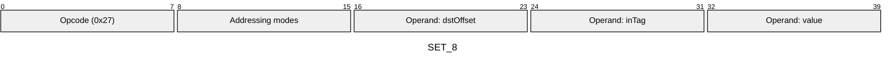
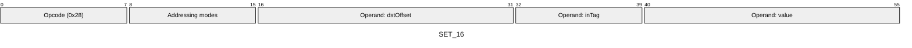
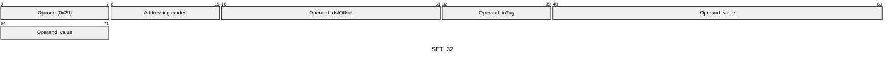
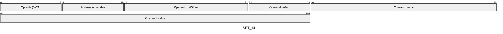
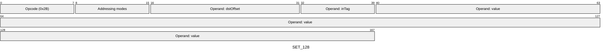
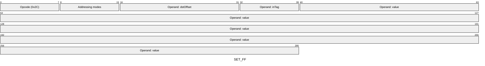
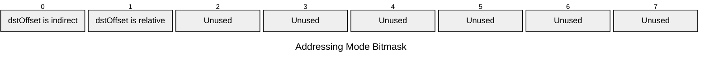

[&larr; Back to Instruction Set: Quick Reference](../avm-isa-quick-reference.md)

# SET

Set memory to immediate value

Opcodes `0x27`-`0x2C` (6 wire formats)

```javascript
M[dstOffset] = value
```

## Details

Stores an immediate value (a constant encoded directly in the bytecode) at the specified memory offset with the given type tag. Multiple wire formats support different value sizes.

## Gas Costs

| Component | Value | Scales with |
|-----------|-------|-------------|
| L2 Base | 27 | - |
| DA Base | 0 | - |
| L2 Addressing | 3 | 3 L2 gas per indirect memory offset<br/>3 L2 gas per relative memory offset |

*See [Gas Metering](gas.md) for details on how gas costs are computed and applied.

## Operands

| Name | Type | Description |
|------|------|-------------|
| `dstOffset` | Memory offset | Memory offset for value will be stored |
| `inTag` | Type tag | Type tag to assign to the value. Unrelated to the opcode's wire format (`SET_8` vs `SET_16`, etc.) |
| `value` | Immediate value | Constant from the bytecode to store into memory |

## Wire Formats
See [Wire Format](wire-format.md) page for an explanation of wire format variants and opcode naming (e.g., why `ADD_8` vs `ADD_16`).

**SET_8** (Opcode 0x27):



**SET_16** (Opcode 0x28):



**SET_32** (Opcode 0x29):



**SET_64** (Opcode 0x2A):



**SET_128** (Opcode 0x2B):



**SET_FF** (Opcode 0x2C):



## Addressing Modes
See [Addressing](addressing.md) page for a detailed explanation.

8-bit bitmask: 2 bits per memory offset operand (indirect flag + relative flag)

Memory offset operands (`dstOffset`) are encoded as follows:



## Tag Updates

- `T[dstOffset] = tag`

## Error Conditions

- **INVALID_TAG**: Specified tag is not a valid TypeTag
- **MEMORY_ACCESS_OUT_OF_RANGE**: Memory offset operand exceeds addressable memory

---

[&larr; Back to Instruction Set: Quick Reference](../avm-isa-quick-reference.md)