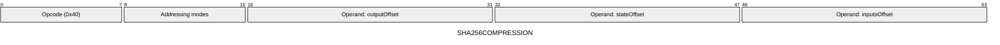
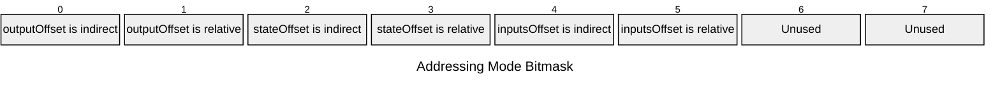

[&larr; Back to Instruction Set: Quick Reference](../avm-isa-quick-reference.md)

# SHA256COMPRESSION

SHA-256 compression

Opcode `0x40`

```javascript
M[outputOffset:outputOffset+8] = sha256compress(/*state=*/M[stateOffset:stateOffset+8], /*inputs=*/M[inputsOffset:inputsOffset+16])
```

## Details

Computes the SHA-256 compression function on an 8-word state and 16-word input block. State and inputs must be Uint32. Outputs 8 Uint32 words.

## Gas Costs

| Component | Value | Scales with |
|-----------|-------|-------------|
| L2 Base | 12288 | - |
| DA Base | 0 | - |
| L2 Addressing | 3 | 3 L2 gas per indirect memory offset<br/>3 L2 gas per relative memory offset |

*See [Gas Metering](gas.md) for details on how gas costs are computed and applied.

## Operands

| Name | Type | Description |
|------|------|-------------|
| `outputOffset` | Memory offset | Memory offset for 8-word output state will be written |
| `stateOffset` | Memory offset | Memory offset of the 8-word SHA-256 state |
| `inputsOffset` | Memory offset | Memory offset of the 16-word input block |

## Wire Formats
See [Wire Format](wire-format.md) page for an explanation of wire format variants and opcode naming (e.g., why `ADD_8` vs `ADD_16`).

**SHA256COMPRESSION** (Opcode 0x40):



## Addressing Modes
See [Addressing](addressing.md) page for a detailed explanation.

8-bit bitmask: 2 bits per memory offset operand (indirect flag + relative flag)

Memory offset operands (`outputOffset`, `stateOffset`, `inputsOffset`) are encoded as follows:



## Tag Checks

- `T[stateOffset:stateOffset+8] == UINT32`
- `T[inputsOffset:inputsOffset+16] == UINT32`

## Tag Updates

- `T[outputOffset:outputOffset+8] = UINT32`

## Error Conditions

- **INVALID_TAG**: State or inputs are not Uint32
- **MEMORY_ACCESS_OUT_OF_RANGE**: Memory offset operand exceeds addressable memory

---

[&larr; Back to Instruction Set: Quick Reference](../avm-isa-quick-reference.md)