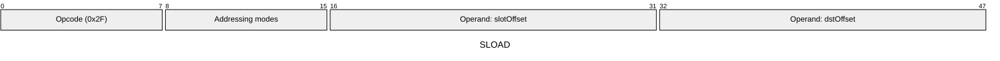
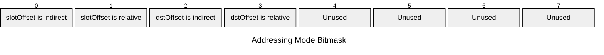

[&larr; Back to Instruction Set: Quick Reference](../avm-isa-quick-reference.md)

# SLOAD

Load value from public storage

Opcode `0x2F`

```javascript
M[dstOffset] = storage[contractAddress][M[slotOffset]]
```

## Details

Reads from public storage at the specified slot. Performs a read of the Public Data Tree. The contractAddress is the address of the currently executing contract and does not come from the bytecode. Both slot and result have type tag FIELD. Gas cost varies based on whether the slot is warm (recently accessed) or cold (first access in this transaction).

## Gas Costs

| Component | Value | Scales with |
|-----------|-------|-------------|
| L2 Base | 129 | - |
| DA Base | 0 | - |
| L2 Addressing | 3 | 3 L2 gas per indirect memory offset<br/>3 L2 gas per relative memory offset |

*See [Gas Metering](gas.md) for details on how gas costs are computed and applied.

## Operands

| Name | Type | Description |
|------|------|-------------|
| `slotOffset` | Memory offset | Memory offset of the storage slot to read from |
| `dstOffset` | Memory offset | Memory offset for loaded value will be written |

## Wire Formats
See [Wire Format](wire-format.md) page for an explanation of wire format variants and opcode naming (e.g., why `ADD_8` vs `ADD_16`).

**SLOAD** (Opcode 0x2F):



## Addressing Modes
See [Addressing](addressing.md) page for a detailed explanation.

8-bit bitmask: 2 bits per memory offset operand (indirect flag + relative flag)

Memory offset operands (`slotOffset`, `dstOffset`) are encoded as follows:



## Tag Checks

- `T[slotOffset] == FIELD`

## Tag Updates

- `T[dstOffset] = FIELD`

## Error Conditions

- **INVALID_TAG**: Slot operand is not FIELD
- **MEMORY_ACCESS_OUT_OF_RANGE**: Memory offset operand exceeds addressable memory

---

[&larr; Back to Instruction Set: Quick Reference](../avm-isa-quick-reference.md)