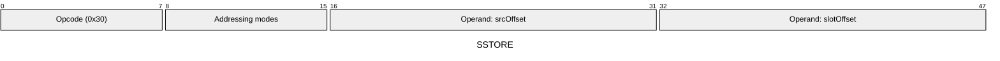
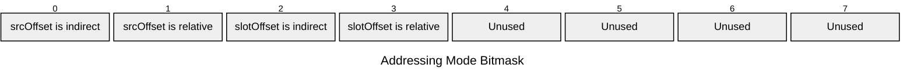

[&larr; Back to Instruction Set: Quick Reference](../avm-isa-quick-reference.md)

# SSTORE

Store value to public storage

Opcode `0x30`

```javascript
storage[contractAddress][M[slotOffset]] = M[srcOffset]
```

## Details

Writes to public storage at the specified slot. Performs a write to the Public Data Tree. The contractAddress is the address of the currently executing contract and does not come from the bytecode. Both slot and value must have type tag FIELD. Gas cost varies based on whether the slot is warm (recently accessed) or cold (first access in this transaction). Reverts in static calls.

## Gas Costs

| Component | Value | Scales with |
|-----------|-------|-------------|
| L2 Base | 33140 | - |
| DA Base | 0 | - |
| L2 Addressing | 3 | 3 L2 gas per indirect memory offset<br/>3 L2 gas per relative memory offset |
| DA Dynamic | 1024 | - |

*See [Gas Metering](gas.md) for details on how gas costs are computed and applied.

## Operands

| Name | Type | Description |
|------|------|-------------|
| `srcOffset` | Memory offset | Memory offset of the value to store |
| `slotOffset` | Memory offset | Memory offset of the storage slot to write to |

## Wire Formats
See [Wire Format](wire-format.md) page for an explanation of wire format variants and opcode naming (e.g., why `ADD_8` vs `ADD_16`).

**SSTORE** (Opcode 0x30):



## Addressing Modes
See [Addressing](addressing.md) page for a detailed explanation.

8-bit bitmask: 2 bits per memory offset operand (indirect flag + relative flag)

Memory offset operands (`srcOffset`, `slotOffset`) are encoded as follows:



## Tag Checks

- `T[slotOffset] == FIELD`
- `T[srcOffset] == FIELD`

## Error Conditions

- **INVALID_TAG**: Slot or value operand is not FIELD
- **STATIC_CALL_VIOLATION**: Attempted storage write in static call context
- **SIDE_EFFECT_LIMIT_REACHED**: Exceeded maximum public data updates per transaction (MAX_PUBLIC_DATA_UPDATE_REQUESTS_PER_TX)
- **MEMORY_ACCESS_OUT_OF_RANGE**: Memory offset operand exceeds addressable memory

---

[&larr; Back to Instruction Set: Quick Reference](../avm-isa-quick-reference.md)