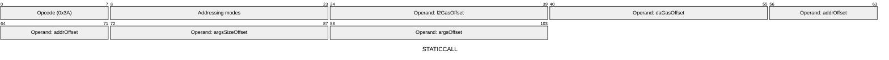
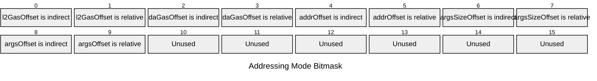

[&larr; Back to Instruction Set: Quick Reference](../avm-isa-quick-reference.md)

# STATICCALL

Static call to external contract

Opcode `0x3A`

```javascript
nestedCallResult = executeContractStatic(
        /*address=*/M[addrOffset],
        /*args=*/M[argsOffset:argsOffset+M[argsSizeOffset]],
        {l2Gas: M[l2GasOffset], daGas: M[daGasOffset]}
    )
```

## Details

Calls another contract in static mode (read-only). Any state modifications in the nested call will cause it to revert. Updates nestedCallSuccess and nestedReturndata.

## Gas Costs

| Component | Value | Scales with |
|-----------|-------|-------------|
| L2 Base | 9936 | - |
| DA Base | 0 | - |
| L2 Addressing | 3 | 3 L2 gas per indirect memory offset<br/>3 L2 gas per relative memory offset |

*See [Gas Metering](gas.md) for details on how gas costs are computed and applied.

## Operands

| Name | Type | Description |
|------|------|-------------|
| `l2GasOffset` | Memory offset | Memory offset of the L2 gas to allocate to the nested call |
| `daGasOffset` | Memory offset | Memory offset of the DA gas to allocate to the nested call |
| `addrOffset` | Memory offset | Memory offset of the target contract address |
| `argsSizeOffset` | Memory offset | Memory offset of the calldata size |
| `argsOffset` | Memory offset | Memory offset of the start of the calldata |

## Wire Formats
See [Wire Format](wire-format.md) page for an explanation of wire format variants and opcode naming (e.g., why `ADD_8` vs `ADD_16`).

**STATICCALL** (Opcode 0x3A):



## Addressing Modes
See [Addressing](addressing.md) page for a detailed explanation.

16-bit bitmask: 2 bits per memory offset operand (indirect flag + relative flag)

Memory offset operands (`l2GasOffset`, `daGasOffset`, `addrOffset`, `argsSizeOffset`, `argsOffset`) are encoded as follows:



## Tag Checks

- `T[l2GasOffset] == UINT32`
- `T[daGasOffset] == UINT32`
- `T[addrOffset] == FIELD`
- `T[argsSizeOffset] == UINT32`

## Tag Updates

- `T[successOffset] = UINT1`

## Error Conditions

- **INVALID_TAG**: Gas, address, or size operands have incorrect tags
- **OUT_OF_GAS**: Insufficient gas for the nested call
- **SIDE_EFFECT_LIMIT_REACHED**: Exceeded maximum unique contract class IDs per transaction (MAX_PUBLIC_CALLS_TO_UNIQUE_CONTRACT_CLASS_IDS)
- **MEMORY_ACCESS_OUT_OF_RANGE**: Memory offset operand exceeds addressable memory

## Notes

- See [External Calls](../external-calls.md) for more details on execution flow.
- See [Calldata and Return Data](../calldata-returndata.md) for more details on passing data.

---

[&larr; Back to Instruction Set: Quick Reference](../avm-isa-quick-reference.md)