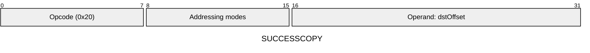
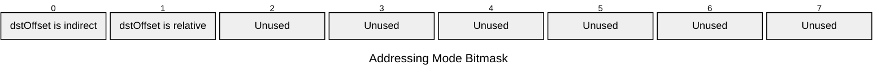

[&larr; Back to Instruction Set: Quick Reference](../avm-isa-quick-reference.md)

# SUCCESSCOPY

Get success status of latest external call

Opcode `0x20`

```javascript
M[dstOffset] = nestedCallSuccess ? 1 : 0
```

## Details

Returns 1 if the most recent nested external call (CALL or STATICCALL instruction) succeeded, 0 if it reverted. Result is Uint1.

## Gas Costs

| Component | Value | Scales with |
|-----------|-------|-------------|
| L2 Base | 12 | - |
| DA Base | 0 | - |
| L2 Addressing | 3 | 3 L2 gas per indirect memory offset<br/>3 L2 gas per relative memory offset |

\* See [Gas Metering](gas.md) for details on how gas costs are computed and applied.

## Operands

| Name | Type | Description |
|------|------|-------------|
| `dstOffset` | Memory offset | Memory offset for success status (0 or 1) will be written |

## Wire Formats
See [Wire Format](wire-format.md) page for an explanation of wire format variants and opcode naming (e.g., why `ADD_8` vs `ADD_16`).

**SUCCESSCOPY** (Opcode 0x20):



## Addressing Modes
See [Addressing](addressing.md) page for a detailed explanation.

8-bit bitmask: 2 bits per memory offset operand (indirect flag + relative flag)

Memory offset operands (`dstOffset`) are encoded as follows:



## Tag Updates

- `T[dstOffset] = UINT1`

## Error Conditions

- **MEMORY_ACCESS_OUT_OF_RANGE**: Memory offset operand exceeds addressable memory

## Notes

- See [External Calls](../external-calls.md) for more details on nested calls and success handling.

---

[&larr; Back to Instruction Set: Quick Reference](../avm-isa-quick-reference.md)
