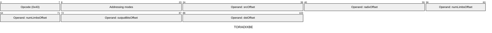
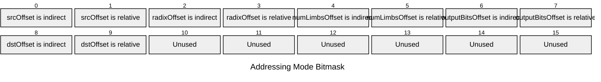

[&larr; Back to Instruction Set: Quick Reference](../avm-isa-quick-reference.md)

# TORADIXBE

Convert to radix (big-endian)

Opcode `0x43`

```javascript
M[dstOffset:dstOffset+M[numLimbsOffset]] = toRadixBE(
        /*value=*/M[srcOffset],
        /*radix=*/M[radixOffset],
        /*numLimbs=*/M[numLimbsOffset],
        /*outputBits=*/M[outputBitsOffset]
    )
```

## Details

Decomposes a field element into limbs in the specified radix (2-256). If outputBits is true (Uint1), outputs Uint1 array; otherwise outputs Uint8 array. Source must be FIELD, radix and numLimbs must be Uint32.

## Gas Costs

| Component | Value | Scales with |
|-----------|-------|-------------|
| L2 Base | 24 | - |
| DA Base | 0 | - |
| L2 Addressing | 3 | 3 L2 gas per indirect memory offset<br/>3 L2 gas per relative memory offset |
| L2 Dynamic | 3 | `M[numLimbsOffset]`, `M[radixOffset]`* |

\*Note: The L2 gas cost scales linearly with M[numLimbsOffset], but also includes a per-limb multiplier based on M[radixOffset]

\* See [Gas Metering](gas.md) for details on how gas costs are computed and applied.

## Operands

| Name | Type | Description |
|------|------|-------------|
| `srcOffset` | Memory offset | Memory offset of the field element to decompose |
| `radixOffset` | Memory offset | Memory offset of the radix (base) for decomposition |
| `numLimbsOffset` | Memory offset | Memory offset of the number of limbs to generate |
| `outputBitsOffset` | Memory offset | Memory offset of the output mode flag (1 for bits, 0 for bytes) |
| `dstOffset` | Memory offset | Memory offset for limb array will be written |

## Wire Formats
See [Wire Format](wire-format.md) page for an explanation of wire format variants and opcode naming (e.g., why `ADD_8` vs `ADD_16`).

**TORADIXBE** (Opcode 0x43):



## Addressing Modes
See [Addressing](addressing.md) page for a detailed explanation.

16-bit bitmask: 2 bits per memory offset operand (indirect flag + relative flag)

Memory offset operands (`srcOffset`, `radixOffset`, `numLimbsOffset`, `outputBitsOffset`, `dstOffset`) are encoded as follows:



## Tag Checks

- `T[srcOffset] == FIELD`
- `T[radixOffset] == UINT32`
- `T[numLimbsOffset] == UINT32`
- `T[outputBitsOffset] == UINT1`

## Tag Updates

- `T[dstOffset:dstOffset+M[numLimbsOffset]] = (M[outputBitsOffset] ? UINT1 : UINT8)`

## Error Conditions

- **INVALID_TAG**: Operands have incorrect type tags
- **INVALID_RADIX**: Radix is not in range [2, 256]
- **INVALID_NUM_LIMBS**: Number of limbs is zero but value is non-zero
- **INVALID_DECOMPOSITION**: Value cannot be decomposed into specified radix/limbs
- **INVALID_BIT_MODE**: Bit mode is enabled but radix is not 2
- **MEMORY_ACCESS_OUT_OF_RANGE**: Memory offset operand exceeds addressable memory

---

[&larr; Back to Instruction Set: Quick Reference](../avm-isa-quick-reference.md)
