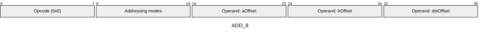
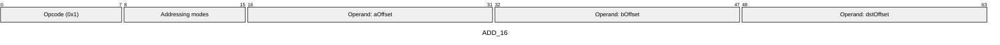
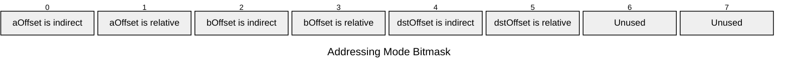

# Wire Formats

The AVM bytecode uses a compact binary encoding where each instruction is serialized as a sequence of bytes according to its **wire format**.

## Key Concept: Opcode Suffixes

>[!IMPORTANT]
> Opcode suffixes like `ADD_8` and `ADD_16` refer to the **size of memory offset operands in the bytecode**, NOT the type of data being operated on.
>
> - `ADD_8`: Memory offsets fit in 8 bits (1 byte each)
> - `ADD_16`: Memory offsets fit in 16 bits (2 bytes each)
>
> Both execute the same ADD operation and work with any supported type (FIELD, UINT1, UINT8, UINT32, UINT64, UINT128, etc.). The difference is purely about bytecode compactness.

### Example: `ADD_8` and `ADD_16`

The numeric suffixes in these opcode names (`_8` or `_16`) indicate the **size of memory offset operands in the bytecode**, not the type of data being operated on.

The actual operation type is determined by the [type tags](memory.md#type-tags) of the resolved memory
locations. For example, `ADD_8` encodes its `aOffset` and `bOffset` operands as 8-bit values in the
bytecode. However, if these offsets (after [addressing mode](addressing.md) resolution) point to memory
cells tagged as UINT128, the instruction performs 128-bit addition. For `ADD`s (and for many other operations),
the AVM enforces that the inputs have matching tags (`T[aOffset] == T[bOffset]`) and then tags the result with that same tag.

Below are the full wire formats for this example along with the addressing modes bitmask:

**ADD_8**

**ADD_16**:

**Addressing Modes**

---
← Previous: [Calldata and Return Data](./calldata-returndata.md) | Next: [Instruction Set: Quick Reference](./avm-isa-quick-reference.md) →
