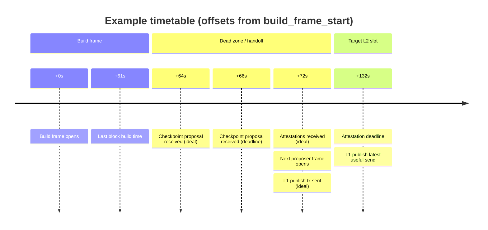
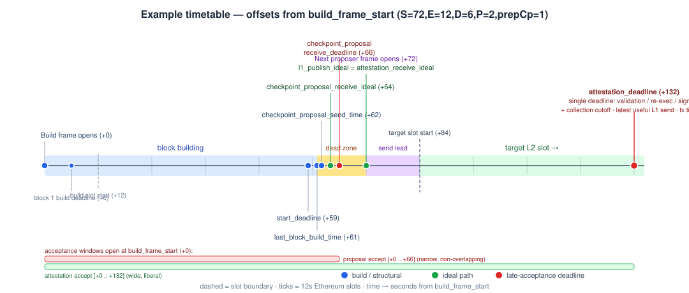

# Block Building Timetable Spec

This document specifies the timing model for pipelined block building, checkpoint validation, attestation collection, and L1 publishing.

## Goals

The timetable has these goals:

- schedule block sub-slots so the proposer produces a checkpoint at a predictable cadence;
- enforce consensus-critical deadlines so validators and the next proposer agree on the proposed chain, by agreeing on when a proposal is too late to build on;
- maximize the time available for the L1 publish transaction by making the payload ready before the ideal L1 send time, which is one Ethereum slot before the target L2 slot;
- accept late checkpoint proposals until the next-proposer handoff deadline, and late attestations until the latest useful L1 publish deadline.

Pipelining is the only production mode. For target slot `target_slot`, the proposer builds during the preceding `build_slot` and the L1 transaction is meant to land inside `target_slot`.

This model does not describe deterministic automine or other synchronous local-mining modes. Those modes may publish inside the same slot and do not use the pipelined build-slot/target-slot timetable.

## Example

This example uses the production-like values proposed below: `aztec_slot_duration = 72s`,
`ethereum_slot_duration = 12s`, `block_duration = 6s`, `p2p_propagation_time = 2s`,
`checkpoint_proposal_prepare_time = 1s`, and `checkpoint_proposal_init_time = 1s`.

All times are offsets from `build_frame_start`. Rows are ordered by the ideal path; deadline-path values show late acceptance cutoffs for the same activity.

| Step | Ideal path | Deadline path |
| --- | ---: | ---: |
| Build frame opens | +0s (`build_frame_start`) | +0s (`build_frame_start`) |
| First sub-slot opens | +1s (`first_subslot_start`) | +1s (`first_subslot_start`) |
| Block 1 build deadline | +7s (`block_build_deadline(0)`) | +7s (`block_build_deadline(0)`) |
| Build slot starts | +12s (`build_slot_start`) | +12s (`build_slot_start`) |
| Latest useful block-building start | +59s (`start_deadline`) | +59s (`start_deadline`) |
| Last block build time | +61s (`last_block_build_time`) | +61s (`last_block_build_time`) |
| Checkpoint proposal sent | +62s (`checkpoint_proposal_send_time`) | +62s (`checkpoint_proposal_send_time`) |
| Checkpoint proposal received | +64s (`checkpoint_proposal_receive_ideal_time`) | +66s (`checkpoint_proposal_receive_deadline`) |
| Proposal validation complete and attestation sent | +70s (`proposal_validation_ideal_time`) | +132s (`attestation_deadline`) |
| Next-proposer handoff complete | +70s (`next_proposer_handoff_ideal_time`) | +72s (`next_proposer_handoff_deadline`) |
| Attestation received / deadline | +72s (`attestation_receive_ideal_time`) | +132s (`attestation_deadline`) |
| Next proposer build frame opens | +72s (`next_proposer_build_frame_start`) | +72s (`next_proposer_build_frame_start`) |
| L1 publish tx sent / latest useful send | +72s (`l1_publish_ideal_time`) | +132s (`attestation_deadline`) |

The ideal path is the proposer scheduling target for maximizing L1 publishing time. The deadline path is the latest consensus-safe path: validators and the next proposer use `checkpoint_proposal_receive_deadline`, which depends only on the target slot timing and `block_duration`.

### Example timeline diagram

The diagram highlights the most relevant steps from the table above, as offsets from `build_frame_start` (`target_slot_start - aztec_slot_duration - ethereum_slot_duration`). Blue marks build/structural deadlines, green marks the ideal path, and red marks the late-acceptance deadlines. Dashed lines are slot boundaries.

_Mermaid version (evenly spaced):_



_SVG version (proportional):_



## Inputs

All timing inputs are expressed in seconds unless otherwise stated. Inputs are grouped by how they are controlled.

### Protocol Constants

These values come from the rollup protocol or network definition. Nodes should not tune them locally.

| Input | Meaning |
| --- | --- |
| `genesis_time` | L1 timestamp for L2 slot zero. |
| `aztec_slot_duration` | Duration of one L2 slot. |
| `ethereum_slot_duration` | Duration of one Ethereum slot. |
| `block_duration` | Normal sub-slot duration allocated to building one block and to validator re-execution. |

`block_duration` should be treated as a network-wide timing constant. Validators use it as the expected re-execution
budget, so proposer and validator nodes must agree on it.

### Build Configuration

These values are operational timing budgets. They may differ between production and local test profiles, but nodes in the
same network should use the same values for coordinated proposer and validator behavior.

| Input | Meaning |
| --- | --- |
| `min_block_duration` | Minimum block-building time that is still worth allocating if the proposer starts late. |
| `p2p_propagation_time` | One-way propagation budget for proposals and attestations. |
| `checkpoint_proposal_prepare_time` | Local time between the last block build finishing and the checkpoint proposal being ready for p2p send. |
| `checkpoint_proposal_init_time` | Proposer budget reserved at the start of the build frame for sync, the proposer check, and checkpoint initialization before the first block sub-slot opens. |

`checkpoint_proposal_prepare_time` includes `completeCheckpoint`, local checkpoint validation, header validation simulation, checkpoint proposal signing, proposed-checkpoint archiver sync, and the immediate call into p2p broadcast.

### Parameters

These values change per timetable evaluation.

| Input | Meaning |
| --- | --- |
| `target_slot` | The L2 slot the checkpoint commits to and whose proposer is building this checkpoint. |

## Derived Slot Times

The model derives all wall-clock times from `target_slot`, `genesis_time`, and the slot durations.

```text
target_slot_start = genesis_time + target_slot * aztec_slot_duration

build_slot = target_slot - 1

build_slot_start = genesis_time + build_slot * aztec_slot_duration

build_frame_start = build_slot_start - ethereum_slot_duration

next_proposer_build_frame_start = target_slot_start - ethereum_slot_duration
```

The build frame starts one Ethereum slot before the build slot starts.

## L1 Publish and Attestation Deadline

The model distinguishes an ideal L1 send time from a single hard attestation deadline.

```text
l1_publish_ideal_time = target_slot_start - ethereum_slot_duration
```

This is the time by which we want the L1 transaction ready and submitted to maximize the chance of inclusion in the first Ethereum block of `target_slot`.

```text
last_ethereum_block_in_target_slot = target_slot_start + aztec_slot_duration - ethereum_slot_duration

attestation_deadline = last_ethereum_block_in_target_slot - ethereum_slot_duration
```

`attestation_deadline` is the hard deadline by which validators must have completed re-execution/validation and signed their attestation. It is also the latest useful L1 send time if the only requirement is for the tx to land in the final Ethereum block inside `target_slot`.

This deadline is consensus-driven, not operational. It is used for inactivity/slashing decisions, so all nodes must agree
on it. It is derived only from slot timing protocol constants.

With `aztec_slot_duration = 72` and `ethereum_slot_duration = 12`:

```text
l1_publish_ideal_time = target_slot_start - 12
attestation_deadline  = target_slot_start + 48
```

## Ideal Times vs Deadlines

_Be conservative in what you send, be liberal in what you accept._

The timetable has two rails:

- **Ideal times** describe when work should complete on the happy path to maximize the L1 publishing window.
- **Deadlines** describe the latest time work can complete under the rule that applies to that activity.

The proposer should schedule block production and checkpoint proposal sending against ideal L1 publishing. Validators and p2p should enforce consensus deadlines, late attestation deadlines, and small clock-disparity tolerances. This lets delayed validators contribute attestations while keeping the proposer from planning around the slow path.

Checkpoint proposal timing has both an ideal target and a hard deadline. The ideal target is derived from the L1 publish path and is not a consensus gate. The hard receive deadline is derived only from the next-proposer handoff constraint.

## Checkpoint Proposal Deadlines

The checkpoint proposal affects consensus: it determines the proposed checkpoint the next proposer may build on top of. For that reason, the receive deadline used for validation must not depend on operational budgets such as p2p propagation or L1 publish preparation time.

The ideal receive time is a proposer scheduling target. It is the receive time that leaves enough room for validators to re-execute the checkpoint and send attestations back by `l1_publish_ideal_time`:

```text
checkpoint_proposal_receive_ideal_time = proposal_validation_ideal_time - block_duration
```

The hard receive deadline is the consensus gate. Validators reject checkpoint proposals that arrive after this time, and the next proposer does not build on them. It is derived from the next proposer's own build frame:

```text
checkpoint_proposal_receive_deadline = next_proposer_build_frame_start - block_duration
```

The send time is proposer-owned and is derived by subtracting one propagation hop from the ideal receive time:

```text
checkpoint_proposal_send_time = checkpoint_proposal_receive_ideal_time - p2p_propagation_time
```

The sequencer does not need to wait for this send time. It should send the checkpoint proposal as soon as the final block and local checkpoint proposal preparation are complete. The proposer schedules block building only against the ideal L1 publish path:

```text
last_block_build_time = checkpoint_proposal_send_time - checkpoint_proposal_prepare_time
```

The first consensus boundary for the checkpoint proposal is `checkpoint_proposal_receive_deadline`, not a send deadline.

## Checkpoint Proposal Materialization and Orphan Pruning

After an in-time checkpoint proposal is received, it still has to validate and materialize into the archiver's
proposed-checkpoint state before the next proposer can safely build on it. The materialization deadline is:

```text
checkpoint_proposal_synced_deadline = next_proposer_build_frame_start + checkpoint_proposal_sync_grace
```

`checkpoint_proposal_sync_grace` is a consensus/network value, defaulting to `2 * block_duration`. It is not an
operator-tuned archiver knob: nodes need to agree on when a received proposal has had enough time to materialize.

Orphan proposed-block pruning has two branches:

- If no checkpoint proposal was received for the orphan slot, the archiver prunes once strictly past
  `checkpoint_proposal_receive_deadline + orphan_proposed_block_prune_jitter`.
- If a checkpoint proposal was received but has not materialized into proposed archiver state, the archiver prunes
  once strictly past `checkpoint_proposal_synced_deadline`.

`orphan_proposed_block_prune_jitter` is archiver-local scheduling jitter, defaulting to 1 second. It only covers
polling and timer skew in the no-proposal branch; it does not define whether a checkpoint proposal is buildable.

The no-proposal branch deliberately does not wait for `attestation_deadline`. A malicious proposer can broadcast
block proposals while withholding transaction data and never send the checkpoint proposal. Other nodes may then
spend the remaining validation window trying to collect missing transactions and re-execute a checkpoint that will
not be buildable by the next proposer. Pruning after the receive deadline plus local jitter restores next-proposer
liveness.

The received-proposal branch gives bounded time for validation and archiver insertion. Validators that do not
finish re-execution before `checkpoint_proposal_synced_deadline` may fail to attest on time and may only follow the
checkpoint once it is re-synced from L1.

## Proposal Validation and Attestation Times

The relevant validator-side activity is proposal validation: receiving proposals, collecting transactions if needed, re-executing blocks, validating the checkpoint, and then signing an attestation.

For intermediate block proposals within the checkpoint, the same principle applies at each sub-slot: validators should receive the proposal, collect any missing transactions, and re-execute the block within the block's validation budget. For the final checkpoint proposal, `proposal_validation_ideal_time` is the aggregate end-of-checkpoint validation target.

Ideal validation completion is computed from the ideal L1 send time:

```text
attestation_receive_ideal_time = l1_publish_ideal_time

proposal_validation_ideal_time = attestation_receive_ideal_time - p2p_propagation_time
```

The hard validation deadline is `attestation_deadline`:

```text
block_validation_deadline = attestation_deadline
checkpoint_validation_deadline = attestation_deadline
```

The ideal difference between validation completion and attestation receipt is one propagation hop:

```text
attestation_receive_ideal_time - proposal_validation_ideal_time = p2p_propagation_time
```

The proposer should aim to have enough attestations by `attestation_receive_ideal_time`. Validators may still validate blocks, validate the checkpoint, and sign attestations until `attestation_deadline`. This deadline is the same for all block proposals and the final checkpoint proposal. It must be consensus-driven because inactivity/slashing checks use it to decide whether a validator failed to attest on time.

The `attestation_deadline` above is a validation/re-execution deadline, not an arrival gate. Arrival at the p2p layer is gated separately and more tightly: intermediate block proposals share the checkpoint proposal's receive window as their arrival gate. Every block proposal for a slot is sent before that slot's checkpoint proposal, so nothing legitimate can arrive after `checkpoint_proposal_receive_deadline`. A block proposal arriving after that deadline is therefore rejected at p2p ingress, exactly as a late checkpoint proposal would be. The `attestation_deadline` remains the validation/re-execution deadline for any block or checkpoint proposal that did arrive in time.

## Block Sub-Slots

Block sub-slots are fixed windows counted from the first sub-slot start, which sits one `checkpoint_proposal_init_time` after `build_frame_start`. `min_block_duration` is the spec name for the minimum execution headroom currently called `minExecutionTime`.

`checkpoint_proposal_init_time` is the proposer budget reserved at the start of the build frame for sync, the proposer check, and checkpoint initialization. The proposer rarely begins building exactly at `build_frame_start` — it enters the build loop only after that prologue completes — so the sub-slot grid is offset by this budget. Without it, any non-zero prologue eats into the first sub-slot, and when `min_block_duration` equals `block_duration` (tight fast profiles) the first sub-slot becomes unstartable, leaving the checkpoint under-packed. This is an operational proposer budget, so it lives in the proposer timetable and does not affect any consensus-acceptance deadline.

```text
first_subslot_start = build_frame_start + checkpoint_proposal_init_time

block_build_start(block_index) = first_subslot_start + block_index * block_duration

block_build_deadline(block_index) = first_subslot_start + (block_index + 1) * block_duration
```

where `block_index` is zero-based.

Sub-slot starts and deadlines do not move when earlier blocks finish early or late. If block `k` finishes early, the proposer waits until `block_build_deadline(k)` before attempting block `k + 1`. If block `k` finishes late, the next sub-slot keeps its original deadline and therefore has less remaining headroom.

The maximum number of full-duration block sub-slots is:

```text
max_blocks_per_checkpoint = floor((last_block_build_time - first_subslot_start) / block_duration)
```

The start deadline is the latest time at which the proposer can still squeeze one minimum-duration block and make the ideal L1 publish path:

```text
start_deadline = last_block_build_time - min_block_duration
```

If the sequencer reaches the build frame after `start_deadline`, it should abandon block production for the slot. A later
checkpoint proposal might still satisfy the consensus receive deadline, but the proposer timetable intentionally does not
plan around that path because it prioritizes publishing at `l1_publish_ideal_time`. If it starts before `start_deadline`
but is late for a particular sub-slot, it should skip to the next available sub-slot with at least `min_block_duration`
remaining.

When choosing whether to start a block, the proposer scans the sub-slots in order and selects the first one whose
deadline is at least `min_block_duration` in the future:

```text
block_build_deadline(block_index) - now >= min_block_duration
```

Sub-slots that do not satisfy this condition are skipped. This is also the rule while waiting for enough transactions. If
the proposer is waiting for txs for a selected sub-slot, it may wait only until:

```text
wait_for_txs_deadline(block_index) = block_build_deadline(block_index) - min_block_duration
```

If enough txs arrive before `wait_for_txs_deadline(block_index)`, the proposer starts building in that sub-slot. If not,
the sub-slot is dropped without committing a block, the proposer waits until the sub-slot deadline, and then retries with
the next available sub-slot. If the dropped sub-slot was the final sub-slot, block production for the checkpoint ends.
Empty-checkpoint forcing may override the tx-count rule, but it must not remove the `min_block_duration` headroom
requirement.

`block_build_deadline(block_index)` is an execution cutoff, not only a scheduling hint. Block building should stop public
tx execution at that deadline and then finalize the block from whatever txs were successfully executed. Finalization may
spill slightly past the deadline, but later sub-slot starts and deadlines must not move.

## Parallel Execution

For non-final blocks, proposer building and committee validation are pipelined. After the proposer finishes and broadcasts
block `k`, validators receive it, collect any missing txs, and re-execute it while the proposer waits for or starts block
`k + 1`.

This is why `block_duration` is used both as the proposer’s normal build cadence and as the validator re-execution
budget. The system does not wait for committee validation of block `k` before beginning block `k + 1`; it relies on the
fixed sub-slot cadence and p2p propagation budget to keep both sides aligned.

The final block is different. There is no block `k + 1` to build in parallel, and the final block should not be broadcast
as a regular block proposal. The proposer holds it and includes it in the checkpoint proposal, then spends the dead zone
assembling and sending that checkpoint proposal, waiting for committee re-execution and attestations, and preparing the
L1 publish request.

## Handling Timing Variations

The sub-slot schedule is fixed, so timing variation changes how much headroom remains; it does not move deadlines.

- If the proposer initializes early, the first block gets extra time before its fixed deadline.
- If the proposer initializes late but the current sub-slot still has at least `min_block_duration` remaining, it may
  build in that sub-slot.
- If initialization or a previous block overrun leaves less than `min_block_duration` before the current sub-slot deadline, that sub-slot is skipped.
- If a block finishes early, the proposer waits until the next sub-slot boundary before attempting the next block.
- If a block finishes late, the next block may still start if some later sub-slot has enough remaining headroom.
- If a block cannot be built because there are not enough txs, the current sub-slot is dropped and the proposer retries at the next available sub-slot, unless the dropped sub-slot was the final one.

## Dead Zone

The dead zone is the time between the previous proposer finishing its final block and the next proposer starting its own build frame. During this interval no proposer is actively building new blocks.

```text
dead_zone = next_proposer_build_frame_start - last_block_build_time
```

Expanded through the ideal L1 publish path:

```text
dead_zone = checkpoint_proposal_prepare_time
  + p2p_propagation_time
  + block_duration
  + p2p_propagation_time
```

The two `p2p_propagation_time` terms are different hops:

- checkpoint proposal propagation from proposer to validators;
- attestation propagation from validators back to the proposer.

The dead zone is deliberate. It buys enough time to assemble and broadcast the checkpoint proposal, let validators re-execute it, and receive attestations back before `l1_publish_ideal_time`. A later checkpoint proposal may still satisfy the consensus handoff deadline, but the proposer does not size block production around that fallback.

## Next-Proposer Handoff

The next proposer must have enough time to receive and re-execute the previous checkpoint before its own build frame starts. This is the consensus-critical receive deadline:

```text
next_proposer_handoff_deadline = checkpoint_proposal_receive_deadline + block_duration

next_proposer_handoff_deadline = next_proposer_build_frame_start
```

The handoff driven by the ideal path that maximizes L1 inclusion times is earlier:

```text
next_proposer_handoff_ideal_time = checkpoint_proposal_receive_ideal_time + block_duration

next_proposer_handoff_ideal_time = next_proposer_build_frame_start - p2p_propagation_time
```

Therefore:

```text
next_proposer_handoff_ideal_time <= next_proposer_build_frame_start

next_proposer_handoff_deadline = next_proposer_build_frame_start
```

The ideal handoff margin is:

```text
next_proposer_build_frame_start - next_proposer_handoff_ideal_time =   p2p_propagation_time
```

The consensus handoff deadline is `p2p_propagation_time` later than the ideal handoff target. That slack is for accepting otherwise valid late checkpoint proposals, not for sizing normal block production.

## Constraints

### Input constraints

```text
target_slot > 0
aztec_slot_duration > 0
ethereum_slot_duration > 0
aztec_slot_duration >= ethereum_slot_duration
aztec_slot_duration % ethereum_slot_duration == 0
block_duration > 0
min_block_duration > 0
min_block_duration <= block_duration
p2p_propagation_time >= 0
checkpoint_proposal_prepare_time >= 0
checkpoint_proposal_init_time >= 0
```

### Build frame constraint

```text
build_frame_start = build_slot_start - ethereum_slot_duration
```

### P2P propagation constraints

```text
checkpoint_proposal_receive_ideal_time - checkpoint_proposal_send_time = p2p_propagation_time

attestation_receive_ideal_time - proposal_validation_ideal_time = p2p_propagation_time
```

### Next proposer constraint

```text
checkpoint_proposal_receive_deadline = next_proposer_build_frame_start - block_duration

next_proposer_handoff_deadline = checkpoint_proposal_receive_deadline + block_duration

next_proposer_handoff_deadline = next_proposer_build_frame_start
```

The ideal target must be no later than the consensus handoff:

```text
next_proposer_handoff_ideal_time = checkpoint_proposal_receive_ideal_time + block_duration

next_proposer_handoff_ideal_time = next_proposer_build_frame_start - p2p_propagation_time

next_proposer_handoff_ideal_time <= next_proposer_handoff_deadline
```

### Attestation deadline constraints

```text
attestation_deadline = last_ethereum_block_in_target_slot - ethereum_slot_duration

block_validation_deadline = attestation_deadline

checkpoint_validation_deadline = attestation_deadline
```

### Checkpoint proposal preparation constraint

```text
checkpoint_proposal_send_time - last_block_build_time = checkpoint_proposal_prepare_time
```

### Minimum useful checkpoint constraint

```text
start_deadline >= build_frame_start
max_blocks_per_checkpoint >= 1
```

Expanded:

```text
last_block_build_time - min_block_duration >= build_frame_start
```

### Ideal-before-deadline constraints

```text
l1_publish_ideal_time <= attestation_deadline
attestation_receive_ideal_time <= attestation_deadline
proposal_validation_ideal_time <= attestation_deadline
checkpoint_proposal_receive_ideal_time <= checkpoint_proposal_receive_deadline
```

### Happy-path readiness constraint

To maximize the L1 publishing window, the proposer should not plan around late attestation acceptance. On the happy path:

```text
actual_checkpoint_proposal_receive_time <= checkpoint_proposal_receive_ideal_time

actual_proposal_validation_complete_time <= proposal_validation_ideal_time

actual_attestation_receive_time <= attestation_receive_ideal_time
```

Then the L1 publish tx can be sent at:

```text
l1_publish_ideal_time
```

For consensus acceptance:

```text
actual_checkpoint_proposal_receive_time <= checkpoint_proposal_receive_deadline
actual_block_validation_complete_time <= attestation_deadline
actual_checkpoint_validation_complete_time <= attestation_deadline
actual_attestation_signed_time <= attestation_deadline
```

## Suggested Constants

These are proposed values for the new model. They intentionally separate production settings from local e2e settings with mocked p2p networks.

### Production

| Input | Proposed value | Rationale |
| --- | ---: | --- |
| `aztec_slot_duration` | 72s | Mainnet-like L2 slot duration. |
| `ethereum_slot_duration` | 12s | Ethereum mainnet slot duration. |
| `block_duration` | 6s | Allows up to 10 blocks while still targeting the ideal L1 publish time. |
| `min_block_duration` | 2s | Conservative minimum useful execution budget. |
| `p2p_propagation_time` | 2s | Conservative one-way proposal/attestation propagation budget. |
| `checkpoint_proposal_prepare_time` | 1s | Conservative checkpoint assembly and broadcast preparation budget. |
| `checkpoint_proposal_init_time` | 1s | Sync + proposer-check + init budget reserved before the first sub-slot. |

Derived shape with these values:

```text
l1_publish_ideal_time is 12s before target_slot_start
attestation_deadline is 48s after target_slot_start
attestation_receive_ideal_time is 12s before target_slot_start
proposal_validation_ideal_time is 14s before target_slot_start
checkpoint_proposal_receive_ideal_time is 20s before target_slot_start
checkpoint_proposal_receive_deadline is 18s before target_slot_start
checkpoint_proposal_send_time is 22s before target_slot_start
last_block_build_time is 23s before target_slot_start
dead_zone = 11s
max_blocks_per_checkpoint = 10
```

The ideal publish path is the normal scheduling target: it reserves one attestation propagation hop, validator re-execution time, one checkpoint proposal propagation hop, and local checkpoint proposal preparation. The hard checkpoint proposal receive deadline is later and is used for consensus acceptance.

### Local e2e with mocked p2p

For mocked p2p networks, local profiles can use shorter propagation and preparation budgets. A fast profile should still
preserve the same ordering constraints as production.

These fast-profile budgets are applied automatically when `ethereum_slot_duration` is below `FAST_PROFILE_ETHEREUM_SLOT_DURATION` (8s): the timetable clamps `p2p_propagation_time`, `checkpoint_proposal_prepare_time`, and `min_block_duration` down to the fast values below. Without this, a fast network would inherit the conservative production budgets (e.g. `p2p_propagation_time = 2s`), which shrink the per-checkpoint build window and under-pack checkpoints. The clamp only lowers budgets, so an operator that explicitly configures a smaller value keeps it; `checkpoint_proposal_init_time` is a proposer prologue budget and is not affected by the profile.

Recommended fast local profile:

| Input | Proposed value | Rationale |
| --- | ---: | --- |
| `aztec_slot_duration` | 36s | Fast local e2e slot duration for epoch tests. |
| `ethereum_slot_duration` | 4s | Fast anvil-style Ethereum slot duration. |
| `block_duration` | 6s | Fast block cadence while still leaving room for validation. |
| `min_block_duration` | 1s | Local execution and mocked p2p are faster; preserves late-start behavior. |
| `p2p_propagation_time` | 0.5s | Mocked one-way proposal/attestation propagation budget. |
| `checkpoint_proposal_prepare_time` | 0.5s | Short local checkpoint assembly and broadcast preparation budget. |
| `checkpoint_proposal_init_time` | 1s | Sync + proposer-check + init budget reserved before the first sub-slot. |

Derived shape with these values:

```text
l1_publish_ideal_time is 4s before target_slot_start
attestation_deadline is 28s after target_slot_start
attestation_receive_ideal_time is 4s before target_slot_start
proposal_validation_ideal_time is 4.5s before target_slot_start
checkpoint_proposal_receive_ideal_time is 10.5s before target_slot_start
checkpoint_proposal_receive_deadline is 10s before target_slot_start
checkpoint_proposal_send_time is 11s before target_slot_start
last_block_build_time is 11.5s before target_slot_start
dead_zone = 7.5s
max_blocks_per_checkpoint = 4
```

Alternative slower-block local profile:

| Input | Proposed value | Rationale |
| --- | ---: | --- |
| `aztec_slot_duration` | 36s |
| `ethereum_slot_duration` | 4s |
| `block_duration` | 8s |
| `min_block_duration` | 1s |
| `p2p_propagation_time` | 0.5s |
| `checkpoint_proposal_prepare_time` | 0.5s |
| `checkpoint_proposal_init_time` | 1s |

This yields `max_blocks_per_checkpoint = 3` for a 36s/4s/8s local profile.
