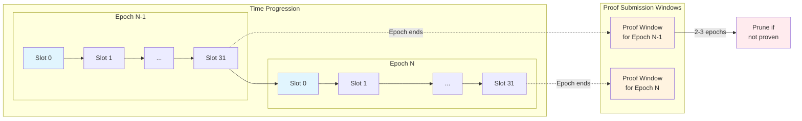

# Validator Client

## Overview

The validator client is a critical component of the Aztec network that enables decentralized block production and validation. It implements the validator logic for participating in the network's consensus mechanism, handling block proposals, attestations, and committee duties.

## Conceptual Overview

### Time-Based Architecture

The Aztec network operates on a deterministic time-based model that coordinates block production:

- **Slots**: Fixed time periods (e.g., 36 seconds) during which one block can be proposed
- **Epochs**: Groups of slots (e.g., 32 slots) that define committee boundaries
- **L1 Alignment**: Slots are synchronized with Ethereum blocks for cross-chain coordination
- **Proof Submission Window**: Period after epoch ends for submitting validity proofs

#### Key Timing Parameters

These are configurable but sane values are:

| Component               | Duration            | Description                         |
| ----------------------- | ------------------- | ----------------------------------- |
| **Slot**                | 36 seconds          | Time for one block proposal cycle   |
| **Epoch**               | 32 slots (19.2 min) | Period with stable committee        |
| **Proof Window**        | 2-3 epochs          | Time to submit validity proof       |
| **Committee Selection** | 2 epochs ahead      | Uses randomness from 2 epochs prior |

### Network Roles

The validator client enables participation in several key network roles:

1. **Validators**: Staked node operators who have registered on L1 and are eligible for selection
2. **Committee Members**: Validators selected for an epoch who attest to block validity
3. **Proposers**: Committee members chosen to create blocks for specific slots
4. **Attesters**: Committee members who verify and sign block proposals

### Block Production Flow

The high-level flow for block production with validator participation:

1. **Committee Formation**: At the start of each epoch, a committee is randomly selected from the validator set
2. **Slot Assignment**: Each slot within the epoch is assigned a specific proposer from the committee
3. **Block Proposal**: The designated proposer builds and broadcasts a block for their slot
4. **Attestation Collection**: Committee members verify the proposal and provide attestations
5. **L1 Submission**: Once >2/3 attestations are collected, the block is submitted to the rollup contract

### Attestation System

Attestations serve a dual purpose in the Aztec network:

- **Data Availability**: Confirm that transaction data is available to the network
- **State Validation**: Verify the correctness of state transitions (acts as training wheels during the transition to full ZK validation)

Blocks require attestations from more than 2/3 of the committee to be considered valid. This Byzantine Fault Tolerant threshold ensures network security even with some malicious validators.

## Validator Responsibilities

Validators have several key responsibilities depending on their role in the current epoch:

### As a Committee Member

When selected as part of an epoch's committee, validators must:

1. **Monitor Block Proposals**: Listen for block proposals from designated proposers
2. **Validate Proposals**: Re-execute transactions to verify state transitions
3. **Attest to Valid Blocks**: Sign attestations for valid proposals
4. **Report Invalid Blocks**: Flag blocks with invalid state or insufficient attestations
5. **Maintain Data Availability**: Store and disseminate block data for the epoch

### As a Proposer

When selected as the proposer for a slot, validators must:

1. **Build Blocks**: Collect transactions from the mempool and construct valid blocks
2. **Include Required Data**: Ensure proper inclusion of L1�L2 messages and state updates
3. **Broadcast Proposals**: Distribute the block proposal to committee members via P2P
4. **Collect Attestations**: Gather signatures from >2/3 of committee members
5. **Submit to L1**: Publish the attested block to the rollup contract

### As a Network Participant

All validators, regardless of current role, must:

1. **Maintain Synchronization**: Keep the node synced with the latest chain state
2. **Participate in P2P**: Relay proposals and attestations through the network
3. **Monitor Performance**: Track their own and others' participation for slashing detection
4. **Update Registry**: Maintain accurate validator information in the L1 registry

### Slashing Conditions

Validators must avoid these slashable offenses:

- **Invalid Block Proposals**: Proposing blocks with incorrect state transitions
- **Invalid Attestations**: Signing blocks with invalid attestations or building on invalid ancestors
- **Insufficient Attestations**: Submitting blocks without required committee support
- **Inactivity**: Failing to propose or attest when required
- **Data Withholding**: Not making block data available for proving

## Validator Selection

The validator selection mechanism ensures fair and unpredictable assignment of responsibilities:

### Committee Selection

At the beginning of each epoch, the committee selection process:

1. **Sample Seed Generation**: Combines L1 prevrandao with epoch number for randomness
2. **Validator Sampling**: Randomly selects validators weighted by stake (if applicable)
3. **Committee Size**: Ensures the target committee size is met (configured at deployment)
4. **Commitment Storage**: Stores committee commitment onchain for verification

Key properties:

- Committee remains stable throughout the entire epoch
- Selection uses prevrandao from 2 epochs prior to prevent manipulation
- All validators have proportional chance based on their stake

### Proposer Selection

For each slot within an epoch:

1. **Deterministic Selection**: Uses epoch seed + slot number to select from committee
2. **Exclusive Rights**: Only the selected proposer can propose for that slot
3. **Predictability Window**: Proposers know their slots at epoch start
4. **Backup Mechanism**: If proposer fails, the slot remains empty (no backup proposers)

### Selection Security

The selection mechanism includes several security features:

- **Randomness Delay**: Uses historical randomness to prevent last-minute manipulation
- **Reorg Resistance**: Two-epoch delay provides protection against L1 reorganizations
- **Commitment Verification**: Onchain commitments prevent committee substitution
- **Deterministic Recovery**: Committee can be reconstructed from onchain data

## Configuration

The validator client requires several configuration parameters:

### Required Settings

- `validatorPrivateKey`: Private key for signing attestations and proposals
- `coinbaseAddress`: Address to receive block rewards
- `feeRecipient`: L2 address for transaction fee collection

### Optional Settings

- `disabledValidators`: List of validator addresses to disable locally
- `validatorReexecute`: Enable transaction re-execution for validation
- `attestationPollingInterval`: Frequency of attestation collection checks
- `attestationTimeout`: Maximum time to wait for attestations

## Architecture

The validator client consists of several key components:

### Core Components

- **ValidationService**: Handles creation and signing of attestations and proposals
- **BlockProposalHandler**: Validates incoming block proposals
- **KeyStore**: Manages validator keys and signing operations
- **EpochCache**: Tracks committee membership and proposer assignments

### Integration Points

- **P2P Network**: Communicates proposals and attestations with other validators
- **Sequencer**: Coordinates block building when selected as proposer
- **L1 Publisher**: Submits attested blocks to the rollup contract
- **Slasher**: Reports misbehavior for slashing

## Metrics and Monitoring

The validator client exposes metrics for monitoring performance:

- Attestations sent/received
- Proposals created/validated
- Committee participation rate
- Slashing events detected
- Network synchronization status

These metrics help validators track their performance and maintain high availability to avoid slashing penalties.
