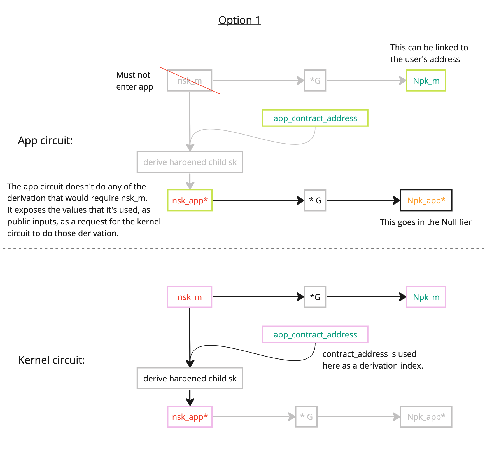

$$
\gdef\sk{\color{red}{sk}}

\gdef\nskm{\color{red}{nsk_m}}
\gdef\tskm{\color{red}{tsk_m}}
\gdef\ivskm{\color{red}{ivsk_m}}
\gdef\ovskm{\color{red}{ovsk_m}}

\gdef\Npkm{\color{green}{Npk_m}}
\gdef\Tpkm{\color{green}{Tpk_m}}
\gdef\Ivpkm{\color{green}{Ivpk_m}}
\gdef\Ovpkm{\color{green}{Ovpk_m}}


\gdef\address{\color{green}{address}}
\gdef\codehash{\color{green}{code\_hash}}
\gdef\constructorhash{\color{green}{constructor\_hash}}
\gdef\classid{\color{green}{class\id}}


\gdef\nskapp{\color{red}{nsk_{app}}}
\gdef\tskapp{\color{red}{tsk_{app}}}
\gdef\ivskapp{\color{red}{ivsk_{app}}}
\gdef\ovskapp{\color{red}{ovsk_{app}}}

\gdef\Nkapp{\color{orange}{Nk_{app}}}

\gdef\Npkapp{\color{green}{Npk_{app}}}


\gdef\Ivpkapp{\color{green}{Ivpk_{app}}}


\gdef\happL{\color{green}{h_{app}^L}}
\gdef\happn{\color{green}{h_{app}^n}}
\gdef\happiv{\color{green}{h_{app}^{iv}}}


\gdef\d{\color{green}{d}}
\gdef\Gd{\color{green}{G_d}}

\gdef\Ivpkappd{\color{violet}{Ivpk_{app,d}}}
\gdef\shareableIvpkappd{\color{violet}{\widetilde{Ivpk_{app,d}}}}
\gdef\Ivpkmd{\color{violet}{Ivpk_{m,d}}}
\gdef\shareableIvpkmd{\color{violet}{\widetilde{Ivpk_{m,d}}}}


\gdef\ivskappstealth{\color{red}{ivsk_{app,stealth}}}
\gdef\Ivpkappdstealth{\color{violet}{Ivpk_{app,d,stealth}}}
\gdef\Pkappdstealth{\color{violet}{Pk_{app,d,stealth}}}
\gdef\ivskmstealth{\color{red}{ivsk_{m,stealth}}}
\gdef\Ivpkmdstealth{\color{violet}{Ivpk_{m,d,stealth}}}
\gdef\Pkmdstealth{\color{violet}{Pk_{m,d,stealth}}}

\gdef\hstealth{\color{violet}{h_{stealth}}}


\gdef\esk{\color{red}{esk}}
\gdef\Epk{\color{green}{Epk}}
\gdef\Epkd{\color{green}{Epk_d}}
\gdef\eskheader{\color{red}{esk_{header}}}
\gdef\Epkheader{\color{green}{Epk_{header}}}
\gdef\Epkdheader{\color{green}{Epk_{d,header}}}

\gdef\sharedsecret{\color{violet}{\text{S}}}
\gdef\sharedsecretmheader{\color{violet}{\text{S_{m,header}}}}
\gdef\sharedsecretappheader{\color{violet}{\text{S_{app,header}}}}


\gdef\hmencheader{\color{violet}{h_{m,enc,header}}}
\gdef\happencheader{\color{violet}{h_{app,enc,header}}}
\gdef\hmenc{\color{violet}{h_{m,enc}}}
\gdef\happenc{\color{violet}{h_{app,enc}}}
\gdef\incomingenckey{\color{violet}{h_{incoming\_enc\_key}}}


\gdef\plaintext{\color{red}{\text{plaintext}}}
\gdef\ciphertext{\color{green}{\text{ciphertext}}}
\gdef\ciphertextheader{\color{green}{\text{ciphertext\_header}}}
\gdef\payload{\color{green}{\text{payload}}}


\gdef\tagg{\color{green}{\text{tag}}}
\gdef\Taghs{\color{green}{\text{Tag}_{hs}}}


$$

## Deriving a nullifier within an app contract

Let's assume a developer wants a nullifier of a note to be derived as:

`nullifier = h(note_hash, nullifier_key);`

... where the `nullifier_key` ($\Nkapp$) belongs to the 'owner' of the note, and where the 'owner' is some $\address$.

Here's example for how an app circuit _could_ constrain the nullifier key to be correct:

### Diagram

It's easiest to take a look at this first:



### Within the app circuit

Within the app, we can prove links between:

- the user's [$\nskapp$](../keys.md#app-siloed-nullifier-secret-key) and their [$\Nkapp$](../keys.md#app-siloed-nullifier-key); and between
- the user's [$\Npkm$](../keys.md#master-nullifier-public-key) and their [$\address$](../address.md).

The link that's missing is to prove that $\Npkm$ relates to $\nskapp$. To compute this missing link requires the $\nskm$, which MUST NOT be passed into an app circuit, and may only be passed into a kernel circuit. See the next ['Within the kernel circuit'](#within-the-kernel-circuit) section for details of this logic.

#### The logic

$$
\begin{aligned}
\Nkapp &= \text{poseidon2}(\nskapp) \\
\text{nullifier} &= \text{poseidon2}(\text{note\_hash}, \Nkapp) \\
\text{public\_keys\_hash} &= \text{poseidon2}(\text{be\_string\_to\_field}(``\text{az\_public\_keys\_hash}"), \Npkm, \Tpkm, \Ivpkm, \Ovpkm) \\
\address &= \text{poseidon2}(\text{be\_string\_to\_field}(``\text{az\_contract\_address\_v1}"), \text{public\_keys\_hash}, \text{partial\_address})
\end{aligned}
$$

> Note: the passing of points directly into the poseidon function is lazy notation: the keys would need to be serialized appropriately as fields into the poseidon function.

> Recall an important point: the app circuit MUST NOT be given $\nskm$. Indeed, $\nskapp$ is derived (see earlier) as a _hardened_ child of $\nskm$, to prevent $\nskm$ from being reverse-derived by a malicious circuit. The linking of $\nskapp$ to $\nskm$ is deferred to the kernel circuit (which can be trusted moreso than an app).

> Recall also: $\Nkapp$ is used (instead of $\nskapp$) solely as a way of giving the user the option of sharing $\Nkapp$ with a trusted 3rd party, to give them the ability to view when a note has been nullified (although I'm not sure how useful this is, given that it would require brute-force effort from that party to determine which note hash has been nullified, with very little additional information).

The app circuit exposes, as public inputs, a "nullifier key validation request":

```rust
let nullifier_validation_request = KeyValidationRequest {
    app_address: app_address,
    claimed_hardened_child_sk: nsk_app,
    claimed_parent_pk: Npk_m,
}
```

### Within the Kernel Circuit

The kernel circuit can then validate the request (having been given $\nskm$ as a private input to the kernel circuit):

$$
\begin{aligned}
\nskapp &= \text{derive\_hardened\_app\_siloed\_secret\_key}(\text{``az\_nsk\_app"}, \text{app\_address}, \nskm) \\
\Npkm &= \nskm \cdot G \\
\nskapp &== \text{claimed\_hardened\_child\_sk} \\
\Npkm &== \text{claimed\_parent\_pk} \\
\end{aligned}
$$

If the kernel circuit succeeds in these calculations, then the $\Nkapp$ has been validated as having a known secret key, and belonging to the $\address$.
