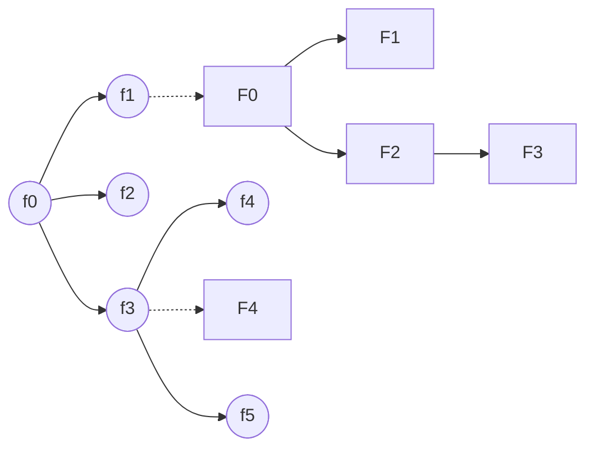
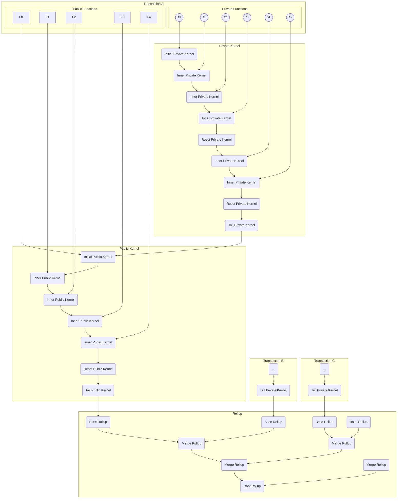

# High Level Topology

:::info Disclaimer
This is a draft. These requirements need to be considered by the wider team, and might change significantly before a mainnet release.
:::

## Overview

A transaction begins with a call to a private function, which may invoke nested calls to other private and public functions. The entire set of private function calls is executed in a secure environment, and their proofs are validated and aggregated by private kernel circuits. Meanwhile, any public function calls triggered from private functions will be enqueued. The proofs for these calls, along with those from the nested public function calls, are generated and processed through public kernel circuits in any entity possessing the correct contexts.

Once all functions in a transaction are executed, the accumulated data is outputted from a tail circuit. These values are then inserted or updated to the trees within the base rollup circuit. The merge rollup circuit facilitates the merging of two base rollup proofs or two merge rollup proofs. Repeating this merging process enables the inclusion of more transactions in a block. Finally, the root rollup circuit produces the final proof, which is subsequently submitted and validated onchain.

To illustrate, consider a transaction involving the following functions, where circles depict private functions, and squares denote public functions:

This transaction contains 6 private functions and 5 public functions, with `f0` being the entrypoint. The entire transaction is processed as follows:

