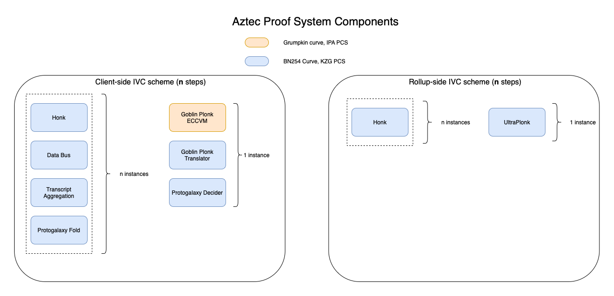

# Proving System Components

# Interactive Proving Systems

## Ultra Plonk

UltraPlonk is a variant of the [PLONK](https://eprint.iacr.org/2019/953) protocol - a zkSNARK with a universal trusted setup.

UltraPlonk utilizes the "Ultra" circuit arithmetisation. This is a configuration with four wires per-gate, and the following set of gate types:

- arithmetic gate
- elliptic curve point addition/doubling gate
- range-check gate
- plookup table gate
- memory-checking gates
- non-native field arithmetic gates

## Honk

Honk is a variant of the PLONK protocol. Plonk performs polynomial testing via evaluating a polynomial relation is zero modulo the vanishing polynomial of a multiplicative subgroup. Honk performs the polynomial testing via evaluating, using a sumcheck protocol, that a relation over multilinear polynomials vanishes when summed over a boolean hypercube.

The first protocol to combine Plonk and the sumcheck protocol was [HyperPlonk](https://eprint.iacr.org/2022/1355)

Honk uses a custom arithmetisation that extends the Ultra circuit arithmetisation (not yet finalized)

# Incrementally Verifiable Computation Subprotocols

An Incrementally Verifiable Computation (IVC) scheme describes a protocol that enables multiple successive proofs to evolve the value taken by some defined persistent state over time.

IVC schemes are used by Aztec in two capacities:

1. to compute a client-side proof of one transaction execution.
2. to compute a proof of a "rollup" circuit, that updates rollup state based on a block of user transactions

Both use IVC schemes. Client-side, each function call in a transaction is a "step" in the IVC scheme. Rollup-side, aggregating two transaction proofs is a "step" in the IVC scheme.

The client-side IVC scheme is substantially more complex than the rollup-side scheme due to performance requiremenmts.

Rollup-side, each "step" in the IVC scheme is a Honk proof, which are recursively verified. As a result, no protoocols other than Honk are required to execute rollup-side IVC.

We perform one layer of "proof-system compression" in the rollup. The final proof of block-correctness is constructed as a Honk proof. An UltraPlonk circuit is used to verify the correctness of the Honk proof, so that the proof that is verified on-chain is an UltraPlonk proof (verification gas costs are lower for UltraPlonk vs Honk).

The following sections list the protocol components required to implement client-side IVC.

## Protogalaxy

The [Protogalaxy](https://eprint.iacr.org/2023/1106) protocol defines a folding scheme that enables instances of a relation to be folded into a single instance of a "relaxed" form of the original relation.

It is a variant of [Protostar](https://eprint.iacr.org/2023/620). Unlike Protostar, Protogalaxy enables multiple instances to be efficiently folded into the same accumulator instance.

The Protogalaxy protocol is split into two subprotocols, each modelled as interactive protocols between a Prover and a Verifier.

#### Protogalaxy Fold

The "Fold" Prover/Verifier validates that `k` instances of a defined relation (in our case the Honk relation) have been correctly folded into an accumulator instance.

#### Protogalaxy Decider

The "Decider" Prover/Verifier valiate whether an accumulator instance correctly satisfies the accumulator relation.

## Goblin Plonk

[Goblin Plonk](https://hackmd.io/@aztec-network/BkGNaHUJn/%2FGfNR5SE5ShyXXmLxNCsg3g) is a computation delegation scheme that improves Prover performance when evaluating complex algorithms.

In the context of an IVC scheme, Goblin Plonk enables a Prover to defer non-native group operations required by a Verifier algorithm, across multiple recursive proofs, to a single step evaluated at the conclusion of the IVC Prover algorithm.

Goblin Plonk is composed of three subcomponents:

#### Transcript Aggregation Subprotocol

This subprotocol aggregates deferred computations from two independent instances, into a single instance

#### Elliptic Curve Virtual Machine (ECCVM) Subprotocol

The ECCVM is a Honk circuit with a custom circuit arithmetisation, designed to optimally evaluate elliptic curve arithmetic computations that have been deferred. It is defined over the Grumpkin elliptic curve

#### Translator Subprotocol

The Translator is a Honk circuit with a custom circuit arithmetisation, designed to validate the input commitments of an ECCVM circuit align with the delegated computations described by a Goblin Plonk transcript commitment

## Plonk Data Bus

The [Plonk Data Bus](https://aztecprotocol.slack.com/files/U8Q1VAX6Y/F05G2B971FY/plonk_bus.pdf) protocol enables efficient data transfer between two Honk instances within a larger IVC protocol.

# Polynomial Commitment Schemes

The UltraPlonk, Honk, Goblin Plonk and Plonk Data Bus protocols utilize Polynomial Interactive Oracle Proofs as a core component, neccessitating the use of polynomial commitment schemes (PCX).

UltraPlonk and Honk utilize multilinear PCS. The Plonk Data Bus and Goblin Plonk also utilize univariate PCS.

For multilinear polynomial commitment schemes, we use the [ZeroMorph](https://eprint.iacr.org/2023/917) protocol, which itself uses a univariate PCS as a core component.

Depending on context we use the following two univariate schemes within our cryptography stack

## KZG Commitments

The [KZG](https://www.iacr.org/archive/asiacrypt2010/6477178/6477178.pdf) polynomial commitment scheme requires a universal setup and is instantiated over a pairing-friendly elliptic curve.

Computing an opening proof of a degree-$n$ polynomial requires $n$ scalar multiplications, with a constant proof size and a constant verifier time.

## Inner Product Argument

The [IPA](https://eprint.iacr.org/2019/1177.pdf) PCS has worse asymptotics than KZG but can be instantiated over non-pairing friendly curves.

Computing an opening proof of a degree-$n$ polynomial requires $2n$ scalar multiplications, with a $O(logn)$ proof size and an $O(n)$ verifier time.

To batch-verify multiple opening proofs, we use the technique articulated in the [Halo](https://eprint.iacr.org/2019/1021) protocol. To compute a proof of a single rollup block, only one linear-time PCS opening proof is verified despite multiple IPA proofs being generated as part of constructing the rollup proof.

# Combined IVC + Proving System Protocol

The following block diagrams describe the components used by the client-side and server-side Provers when computing client proofs and rollup proofs respectively.

