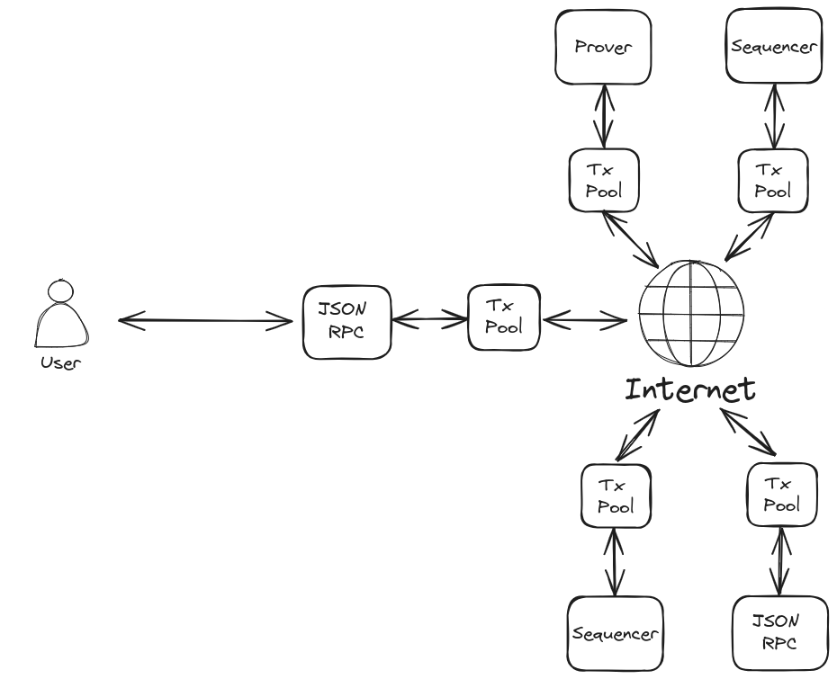

## Requirements for a P2P Network

:::info Disclaimer
This is a draft. These requirements need to be considered by the wider team, and might change significantly before a mainnet release.
:::

When rollups are successfully published, the state transitions are published along with it and are publically retrievable. This category of state does not depend on the Aztec network for its persistence or distribution. Transient data such as pending user transactions for inclusion in future rollups however does rely on the network for these functions. Network participants will consist of:

* Sequencers - responsible for selecting transactions from the global pool and including them in rollups
* Provers - responsible for generating zk-proofs for the transaction and rollup circuits

Pending transactions will be the primary category of data being transmitted through the network. It is important that the network provides a performant, permissionless and censorship resistant mechanism for the effective propagation of these transactions to all sequencers. Without this, transactions may be disadvantaged and the throughput of the network will deteriorate.

Other data that may be transmitted over the network are the final rollup proofs to be submitted to the rollup contract, the size and rate of these payloads should not make any meaningful impact on the bandwidth requirements.

### Network Capacity

Transactions are composed of a number of data elements and can vary in size predominantly based on their deployment of any public bytecode and the private kernel proof. A typical transaction that emits a private note and an unencrypted log, makes a public call and contains a valid proof would consume approximately 40Kb of data. A transaction that additionally deploys a contract would need to transmit the public bytecode on top of this.

| Element | Size |
| ------- | ---------------- |
| Public Inputs, Public Calls and Emitted Logs | ~8Kb |
| Private Kernel Proof | ~32Kb |

At throughputs of 10 and 100 transactions per second, we can arrive at average network bandwidth requirements of 400Kb and 4000Kb per second respectively.

### Sequencer to Prover Communication

There shouldn't be any requirement for the network to handle communication from sequencers to provers for the purpose of generating proofs. Proving is an out-of-protocol activity so it is likely that provers will obtain their input data in one of 2 ways.

* Via a direct interface to a prover marketplace over a protocol such as http
* The provers will independently know the sequence of transactions from the commitment phase of the sequencer selection protocol. They can then use the transaction pool to maintain their own state for proof generation

### Network Topology and Submitting Transactions

Aztec Node instances will offer a JSON RPC interface for consumption by a user's PXE. Part of this API will facilitate transaction submission directly to the node which will then forward it to the network via the transaction pool.

