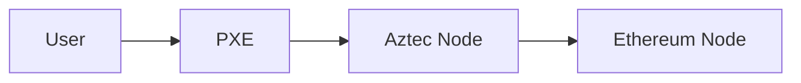

To analyze the suitability of different node types for various actor types in your system, let's break down the node types and actor types, considering the characteristics, preferences, abilities, and potential motivations of each actor. This will help determine which actors are likely to run which nodes and how they might interact with the Private eXecution Environment (PXE).

## Node Types

The below node types are ordered in resource requirements. The types exists both in the context of Aztec but also other blockchains. All the nodes, participate in the peer-to-peer (p2p) network, but with varying capacity.

1. **Light Node**: 
    - Follows the blockchain but only interested in headers (stores headers).
    - Minimal resource requirements.
    - Can be used to anchor state membership proofs with hard-to-manipulate state root.
2. **Pruned Full Node**:
   - Stores complete state, but only subset of logs and history.
   - Requires less storage than a Full Node.
   - Can be used to simulate transactions and view current state.
2. **Full Node**:
    - Stores complete state, logs and history.
    - Requires large storage and a stable internet connection.
    - Can be used to simulate transactions and view current state and provide history for new nodes to sync.
3. **Archive Node**:
    - Stores complete state, logs and history as well as historical state.
    - Needs significant storage capacity.

When running an Aztec node the actor must connect it to nodes of the underlying blockchain(s). The underlying chains being where data is published and proofs validated. For the following outline, I'm assuming that we just have 1 underlying chain, the Ethereum L1. However, in the future, if data is published on other chains, we will need to extend the constellations with those as well. Also, **blobs** are not stored forever, so what is usually referred to as the history of Ethereum will not longer contain them but just their commitments.

#### Special nodes
Special nodes are nodes that have specific tasks beyond synchronizing the chain. Namely they participate in block production. In Ethereum they are called validators, but for the sake of briefness, we skip those here, and mainly focus on the Aztec specific nodes.

These nodes are the sequencer and prover nodes. To function they must be connected to a Pruned Full Node, Full Node or Archive Node. 

1. **Sequencer**: 
   - Requires computational power to simulate blocks.
   - Needs a robust network to coordinate proof generation and propagate blocks.
2. **Provers**: 
   - Have high-performance CPUs/GPUs and a lot of memory.
   - Assists in proving zero-knowledge (zk) proofs for block validation.

### Aztec Data Retrieval Capabilities:
An Aztec node needs to be connected to an Ethereum L1 node to learn about the state of the system. Initially synching can be done this way, but due to the validity proofs, it will also support to download the state from a third party and then match it against the L1 state transitioner to validate that the state is correct. 

As the Aztec node can be connected to different types of underlying network nodes, its ability to retrieve data will vary. Below we outline briefly what the capabilities are for each type of node:
1. **Ethereum Light Node**:
   - Relies on third party for getting L2 headers and block data.
2. **Ethereum Pruned Full Node**:
   - Can lookup recent L2 headers and blocks from own data.
   - Relies on third party for getting historical blocks
3. **Ethereum Full Node**:
   - Can lookup L2 headers from own data.
   - Can lookup recent L2 blocks from own data
   - Relies on third party for getting historical blocks
4. **Ethereum Archive Node**:
   - Can lookup L2 headers and blocks from own data.

### Actor Types

1. **Retail**:
   - Least knowledgeable and least interested in technical details.
   - Prefers simplicity and ease of use.
   - Likely to avoid running any node software or only running if bundled
2. **Enthusiast**: 
   - More knowledgeable and interested in technology than retail.
   - Willing to invest time and resources but not at a professional level.
3. **Power Users**: 
   - Technically proficient and deeply engaged.
   - Likely to have the resources and motivation to run more demanding nodes.
4. **Developers**: 
   - Highly knowledgeable with technical skills.
   - Interested in detailed state and historical data for development and testing.
5. **Self-Validators**: 
   - Aim to participate actively in keeping the blockchain available.
   - Interested in relying on their own nodes and resources (Archive Nodes).
   - Likely to run nodes that contribute directly to the blockchain's operation, like Sequencers or Provers.
6. **Institutions**: 
   - Have significant resources (and potentially technical) capabilities.
   - Interested in robust participation, potentially running Sequencer or Provers for financial gain.

:::info State-Snapshots
State snapshots are likely made and published by actors in the **Self-validator** or **Institution** category. These are actors that have the resources to run Archive Nodes and are interested in the historical data.
:::

### Private eXecution Environment (PXE)

The Aztec PXE is required to do anything meaningful for an end-user. It is the interface between the user and the Aztec node. The PXE is a private enclave that runs on the end-user's machine.

It is responsible for execution contracts and building proofs for the user's transactions privately. This requires the PXE to be connected to a node that can provide the user's state.

:::info Note-discovery
Note, that as the node will not store secrets for the user. The user relies on some mechanism to figure out "what to lookup", this is what is sometimes referred to as note-discovery: discovering what notes belong to the user.
:::

As the PXE learns of the users' notes, it stores them in a database for later usage. Beware that the PXE needs to revalidate the membership paths of the notes when they are to be spent. These paths will be obtained from an Aztec node.

### Users

From the end-users perspective, they will be interacting with the PXE, which is then talking to the aztec node and the underlying chain.

The type of node the PXE is connected to depends on the actor type. 

:::info Bundling
For a mobile application to work nicely for the users the PXE will most likely be bundled with a light node on device. This will allow the user to interact with the system without wider knowledge. Settings might allow you to connect the PXE directly to an endpoint for a node for advanced users.
:::

1. **Retail**: 
   - Running the bare minimum. PXE bundled with a light node.
   - Likely using low-power devices like mobile phones or old laptops.
   - Relies heavily on third-party services (Infura for L1 and some form of private information retrieval service (e.g. Oblivious Message Retrieval service) for L2 state)
2. **Enthusiast**:
   - While not fully retail, they are still not interested in running a full node. Essentially the same as retail from end-user perspective.
3. **Power Users**:
   - Will likely run a (pruned) full node, with their PXE connected to it.
   - Relies on third-party services for historical L1 data, but not for L2 data.
4. **Developers**:
   - Similar to power user, but more likely to run non-pruned node with their PXE connected to it.
   - Non-pruned used for other data access
5. **Self-Validators**:
   - Likely to run a full node or archive node with their PXE connected to it..
6. **Institutions**:
   - Likely to use a managed service for running multiple nodes, for better P2P connectivity, and as a result, improved data propagation.
   - Connecting their PXE to this managed service.

---

