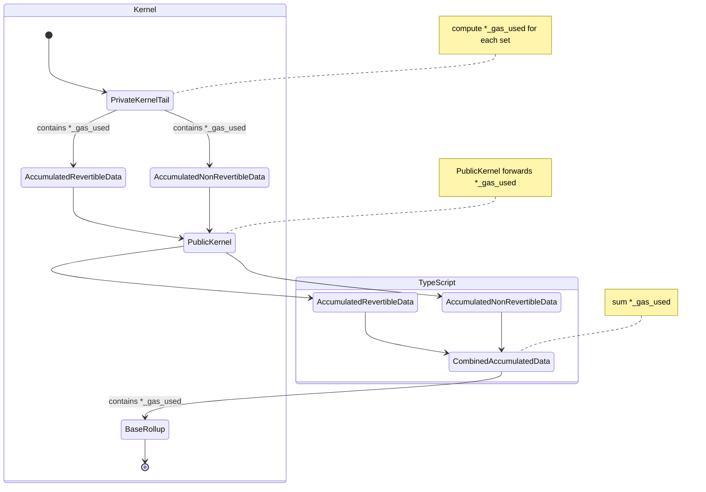
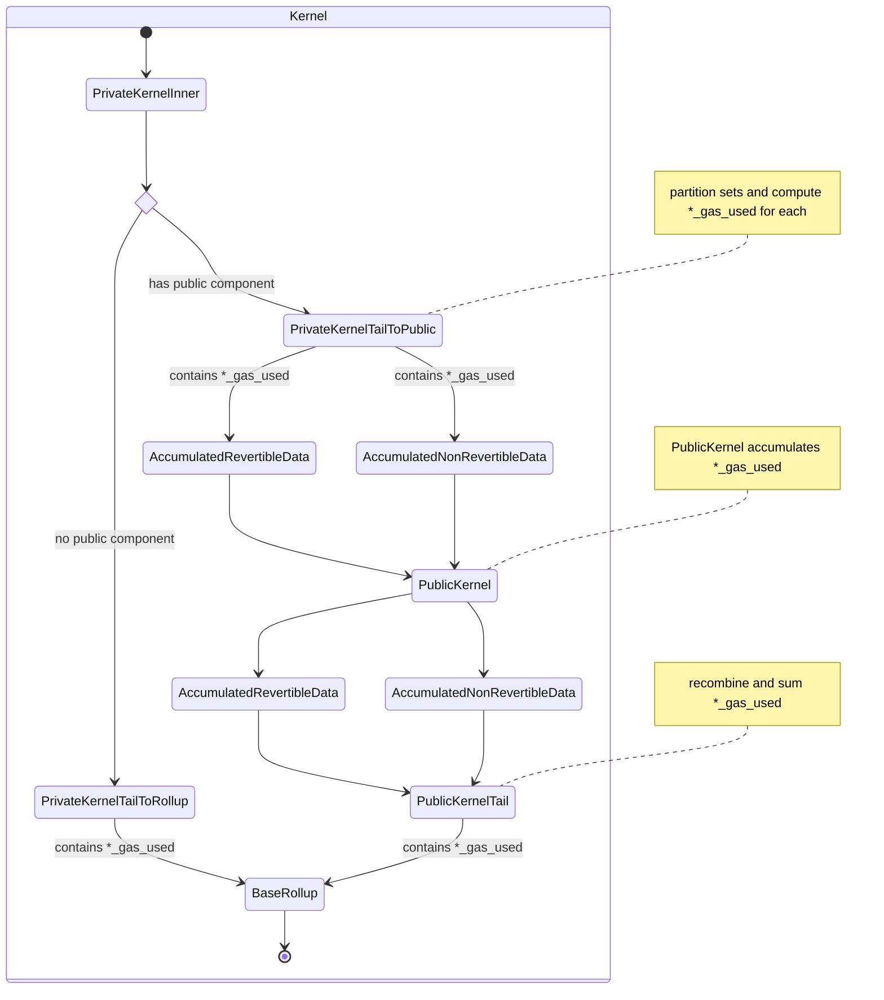

:::note
This page reflects the implementation of the Aztec protocol as of 2024-03-22.
:::

# Multivariate Fee Mechanism

We charge transactions based on their "compute" and "DA" costs. Each transaction is published with:

- `da_gas_used`


`*_gas_used` is used in this document to refer to either `da_gas_used` or any other gas used in the future.

# DA Layer

The DA solution in use is ethereum call data. A moderate effort has been made to design a system that can transition to a different solution in the future, e.g. blobs.

# DA Costs per Transaction

A transaction consumes a variable amount of DA gas, calculated as:

```
da_gas_used = FIXED_DA_GAS +
                note_hash_gas +
                nullifier_gas +
                l2_to_l1_message_gas +
                public_data_writes_gas +
                log_gas
```

where

```
DA_GAS_PER_BYTE = 16

// 17 * 16; 8 for da_gas_used, 8 for compute_gas_used, 1 for revert_code, times DA_GAS_PER_BYTE
FIXED_DA_GAS = 272

DA_BYTES_PER_FIELD = 32
```

and

```
note_hash_gas = da_gas_per_field * (number of notes)
nullifier_gas = da_gas_per_field * (number of nullifiers)
l2_to_l1_message_gas = da_gas_per_field * (number of l2_to_l1_messages)
public_data_writes_gas = 2 * da_gas_per_field * (number of public_data_writes)

DA_BYTES_PER_FIELD = 32
da_gas_per_field = DA_BYTES_PER_FIELD * DA_GAS_PER_BYTE
```

finally

```
log_gas = DA_GAS_PER_BYTE * (unencrypted_log_preimages_length + encrypted_log_preimages_length)
```

## Deviation from ethereum calldata pricing

Our `da_gas_used` will be correlated with the actual ethereum gas consumed by the published call, but not equal.

This is because calculating the exact cost requires us to know how many non-zero bytes are in the calldata, which includes the `da_gas_used` itself. Since the `da_gas_used` must be produced in our kernel circuits, such a recursive calculation would unnecessarily complicate the circuit design.

Instead, using a fixed cost plus scaling on actual resources consumed dramatically simplifies calculations, is a reasonable approximation, and affords abstraction if/when we transition to a different DA solution.

## Inclusion in published transactions

The `*_gas_used` values are included in the [published transaction data](../data-publication-and-availability/published-data.md).

# Proving

## Tracking in kernels

In the private kernel tail, we split side effects into `revertible` and `non-revertible` sets.

Since the revertible set may be dropped, we must track `da_gas_used` for each set.

Thus, we have `*_gas_used: u64` in all the "accumulated data" structs throughout the kernel:

- `PrivateAccumulatedRevertibleData`
- `PrivateAccumulatedNonRevertibleData`
- `PublicAccumulatedRevertibleData`
- `PublicAccumulatedNonRevertibleData`
- `CombinedAccumulatedData`

## DA metering for private

We compute the `da_gas_used` for both the `revertible` and `non-revertible` sets in the private kernel tail, according to the formula above.

## No public metering at present

It is unknown how the public kernel and public VM will interact on DA gas. Ideally, the public VM would meter DA gas and publish results/reverts to the kernel.

For the present, the `*_gas_used` fields will be forwarded through the public kernel.

<!-- TODO(@just-mitch) sync with VM team -->

## Recombining for base rollup

Presently we recombine the `PublicAccumulatedRevertibleData` and `PublicAccumulatedNonRevertibleData` into `CombinedAccumulatedData` in TypeScript (issue [#5013](https://github.com/AztecProtocol/aztec-packages/issues/5013)).

This recombination includes `da_gas_used` and `compute_gas_used`, computed as

```
combined.da_gas_used = non_revertible.da_gas_used +
                        non_revertible.revert_code == 0 ? revertible.da_gas_used : 0
```

## Content commitment

The `*_gas_used` values are included in the content commitment for the base rollup.

The values are up-casted from `u64` to `Field` for the content commitment.

This is matched when

## Current state diagram

The current state diagram is as follows:



## Future work

After [#5013](https://github.com/AztecProtocol/aztec-packages/issues/5013) is fixed, a possible configuration is:




