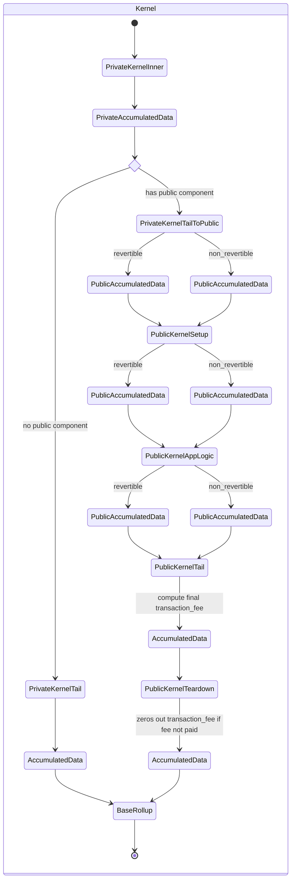

# Gas Metering and Fees

# Disclaimers, assumptions, key points

:::warning
This document contains proposed changes to the protocol.

Please read it closely.
:::

### Assumptions
There are a handful of major assumptions that this document makes, in line with the current state of the protocol:

- There is no enshrined enforcement of fee payment
- We must support pure private transactions
- We publish full transaction effects for each transaction

:::warning
Are these assumptions still valid?
:::

### Naming

The existing terminology refers to:
- "DA gas"
- "L2 gas"
- "L1 gas"

We feel that more appropriate names are:
- "DA gas" -> "storage gas", as it covers state growth on L2 and publishing to DA
- "L2 gas" -> "compute gas", as it covers computation on L2 and proving of public VM circuits
- "L1 gas" -> "cross-chain gas", as it covers the cost of l2-to-l1 messages 

We've kept the existing terminology in this document elsewhere, but propose this change.

### Key points

- formalizing the notion that only functions with a public component can pay fees (since a purely private transaction cannot call `pay_fee`)
- metering along `da_gas_used`, `l2_gas_used`, and `l1_gas_used`
- inclusion of a `pending_header` in public kernel inputs
- a protocol specified `fee_per_da_gas`, `fee_per_l2_gas`, `fee_per_l1_gas` within the `pending_header`. (static scalars, placeholding 1559)
- distilling all amortized/non-metered costs into an `inclusion_fee`
- running public teardown after public tail so that we have an accurate/final number for accumulated gas/fee
- publishing various data pertaining to fees
- the addition of a `fee_paid` flag in the public VM machine state
- the public VM be able to pass (at least parts of) its machine state into the public kernel
- that the total, published `transaction_fee` only be non-zero in the event the fee was paid
- that the sequencer be paid the published `transaction_fee` on L1
- reverts in the public vm don't nuke all gas dimensions
- "handled" nested reverts in the public vm refund da_gas_used and l1_gas_used

# Kernel state diagram

The state diagram is as follows:



# The Aztec token

:::warning
This token will not be called the Aztec token in the final implementation. It, and the symbol `$AZT`, are placeholders.
:::

`$AZT` is an enshrined token that is used to pay fees on Aztec. It has the following properties:

- It is fungible
- It is obtained via a "1-way bridge" from Ethereum
- Its balances are public
- It cannot be transferred between users
- It exposes a public `pay_fee` function which inspects the public context for the `transaction_fee`, and reduces the caller's balance by that amount


# Transaction costs

### Transaction specific costs

Transactions specify/consume:
- variable amounts "gas", which must be multiplied by a "fee per gas" to arrive at a fee in `$AZT`.
- fixed amounts of `$AZT`

Transactions consume gas across three dimensions:

- making the data associated with the transaction available
- computation on L2 
- sending messages to L1

We meter each of these dimensions per transaction as "da gas", "l2 gas", and "l1 gas", respectively.

### Transaction overhead costs

There are costs associated with including transactions in blocks, and blocks in the rollup, independent of what the transaction does.

These include: 

- verification of transaction's private kernel proof
- verification of nullifiers
- proving the rollup circuits
- verification of the root rollup proof on L1

For any transaction in a block of a given size at a given time, the costs are the same.

Since these costs are paid by actors *other than* the user who submits the transaction (e.g. sequencers), the user must be able to specify a fee that they are willing to pay for these costs for inclusion.

We term this a transaction's "inclusion fee", as it is the flat fee (in `$AZT`) the user is willing to pay for the transaction to be included in a block.

:::note Overhead costs are not constant
The costs the inclusion fee is thought to cover are **not constant**.

E.g. if an identical transaction is submitted at time `t` and time `t+1`, the costs to the sequencer might be higher at `t+1` because the the gas price on L1 has increased, and thus verification costs are higher.

We will need to develop a mechanism to ensure the user can specify a fee that is both reasonable and likely to be included in a block, and that the sequencer is compensated fairly for the costs they incur.

Open discussions are being had around using a [Shapley cost sharing mechanism here](https://en.wikipedia.org/wiki/Shapley_value).

In the immediate term, we will risk bad UX: the user will need to look at the `inclusion_fee` from previously included transactions to get a sense of what is reasonable, and thus likely overpay.
:::

# Fees per gas

The fees per unit gas are set by the protocol, and are not part of the user's transaction.

The fees are:

- `fee_per_da_gas`: 1 `$AZT`
- `fee_per_l2_gas`: 1 `$AZT`
- `fee_per_l1_gas`: 100 `$AZT`

:::note
Current thinking is that these fees will eventually be dynamic, and set by the protocol based on demand, similar to eip-1559 style mechanics.

E.g. [op stack directly scales off ethereum base fees for DA costs](https://docs.optimism.io/stack/transactions/fees#l1-data-fee)
:::

# Transaction fee

A transaction fee is the maximum amount of `$AZT` that a user can be charged for a transaction.

```
transaction_fee = fee_per_da_gas * da_gas_used
                    + fee_per_l2_gas * l2_gas_used 
                    + fee_per_l1_gas * l1_gas_used
                    + inclusion_fee
```

:::warning Fees are not enforced 
It is not enforced by the protocol that the `transaction_fee` is actually paid. It is up to the sequencer to enforce this.

The **only way** the `transaction_fee` is paid is if the transaction includes a "teardown" function that calls `pay_fee` on the enshrined gas token. [More on this below](#validating-fee-payment).

When a transaction is published, the `transaction_fee` is included but is only non-zero if the fee was paid.
:::

### `l1_gas_used`

`l1_gas_used` is the amount of gas consumed by the transaction while sending messages to L1.

Each message sent to L1 consumes 1 unit of L1 gas.


### `l2_gas_used`

`l2_gas_used` is the amount of gas consumed by the transaction while executing the public VM.

It is comprised of the sum of:
- the sum of all gas consumed by the public VM viz opcode-based metering
- the number of enqueued public function calls, multiplied by a fixed amount of gas per call

The second component compensates the sequencer for the cost of proving the public VM circuits.

:::warning
Add link to l2 opcode metering
:::


### `da_gas_used`

`da_gas_used` is the amount of DA gas consumed by the transaction.

```
da_gas_used = FIXED_DA_GAS +
                note_hash_gas +
                nullifier_gas +
                l2_to_l1_message_gas +
                public_data_writes_gas +
                log_gas +
                teardown_da_gas
```

where

```
DA_BYTES_PER_FIELD = 32
DA_GAS_PER_BYTE = 16
FIXED_DA_GAS = 512
```

and

```
da_gas_per_field = DA_BYTES_PER_FIELD * DA_GAS_PER_BYTE

note_hash_gas = da_gas_per_field * (number of notes)
nullifier_gas = da_gas_per_field * (number of nullifiers)
l2_to_l1_message_gas = da_gas_per_field * (number of l2_to_l1_messages)
public_data_writes_gas = 2 * da_gas_per_field * (number of public_data_writes)
```

finally

```
log_gas = DA_GAS_PER_BYTE * (unencrypted_log_preimages_length + encrypted_log_preimages_length)
teardown_da_gas = { specified by user }
```

:::note Deviation from ethereum calldata pricing

Our `da_gas_used` will be correlated with the actual ethereum gas consumed by the published call, but not equal.

This is because calculating the exact cost requires us to know how many non-zero bytes are in the calldata, which includes the `da_gas_used` itself. Since the `da_gas_used` must be produced in our kernel circuits, such a recursive calculation would unnecessarily complicate the circuit design.

Instead, using a fixed cost plus scaling on actual resources consumed dramatically simplifies calculations, is a reasonable approximation, and affords abstraction if/when we transition to a different DA solution.
:::


# User transaction variables

The user must be able to specify:

- `da_gas_limit`: the **maximum** amount of DA gas the user is **willing** to pay for, **inclusive** of `teardown_da_gas`
- `teardown_da_gas`: the amount of DA gas the user **will pay** for the teardown function
- `max_fee_per_da_gas`: the maximum price the user is willing to pay per unit of DA gas in `$AZT`
- `l2_gas_limit`: the **maximum** amount of l2 gas the user is **willing** to pay for, **inclusive** of `teardown_l2_gas`
- `teardown_l2_gas`: the amount of l2 gas the user **will pay** for the teardown function
- `max_fee_per_l2_gas`: the maximum price the user is willing to pay per unit of l2 gas in `$AZT`
- `l1_gas_limit`: the **maximum** amount of l1 gas the user is **willing** to pay for, **inclusive** of `teardown_l1_gas`
- `teardown_l1_gas`: the amount of l1 gas the user **will pay** for the teardown function
- `max_fee_per_l1_gas`: the maximum price the user is willing to pay per unit of l1 gas in `$AZT`
- `inclusion_fee`: the flat fee the user is willing to pay for transaction inclusion in `$AZT`


# Sequencer checks

Even though fees are not enforced by the protocol, the sequencer can check ahead of time if it is possible that the transaction **could** pay the fee.

This is done by inspecting the public call enqueued for teardown, checking who the message sender is, and inspecting the balance of the `$AZT` for that sender.

Note: it does not know by inspecting the enqueued call itself if the `pay_fee` function will be called, unless it has explicitly inspected/whitelisted the function ahead of time.

However, it will know that if `pay_fee` is called, then message sender is the one that will pay the fee, and thus must have a balance greater than:
```
msg_sender.balance >= max_fee_per_da_gas * (da_gas_limit + teardown_da_gas)
                        + max_fee_per_l2_gas * (l2_gas_limit + teardown_l2_gas)
                        + max_fee_per_l1_gas * (l1_gas_limit + teardown_l1_gas)
                        + inclusion_fee
```

It will likely also want to check that `max_fee_per_*_gas` are at least as high as the current `fee_per_*_gas`.

# Tracking in kernels

### GasUsed

We have a `GasUsed` that contains:

- `da_gas_used`
- `l2_gas_used`
- `l1_gas_used`

### GasLimits

We have a `GasLimits` that contains:

- `da_gas_limit`
- `max_fee_per_da_gas`
- `teardown_da_gas`
- `l2_gas_limit`
- `max_fee_per_l2_gas`
- `teardown_l2_gas`
- `l1_gas_limit`
- `max_fee_per_l1_gas`
- `teardown_l1_gas`
- `inclusion_fee`

### CallContext

- `gas_limits`
- `transaction_fee`
  - Only non-zero during teardown

### PrivateKernelPublicInputs

- `gas_limits`
- `end`: `PrivateAccumulatedData`

### PrivateAccumulatedData

- `gas_used`

:::note
The l2_gas_used in the `PrivateAccumulatedData` should be zero, since the private kernel does not meter l2 gas.

It is kept in the `GasUsed` struct for consistency.

It is possible to optimize this by removing it from the private accumulated data if we choose.
:::

### PublicKernelPublicInputs

- `gas_limits`
- `end`: `PublicAccumulatedData`
- `end_non_revertible`: `PublicAccumulatedData`

### PublicAccumulatedData

- `gas_used`

### PublicCircuitPublicInputs

- `fee_paid`
  - false unless the `pay_fee` function was called in teardown

### KernelCircuitPublicInputs
- `gas_limits`
- `transaction_fee`
  - Summed during public kernel tail
  - Zero-ed during public kernel teardown if `fee_paid` is false
- `end`: `AccumulatedData`

:::caution `transaction_fee` Naming
It is a possible point of confusion that `transaction_fee` can flip-flop between being the fee that **could be** paid and the fee that **was** paid.

The mental model to use is a `Promise<Option<number>>`, i.e. it is only non-zero if the fee was paid, and we don't know what it is until the base rollup circuit.
:::

### AccumulatedData
- `gas_used`

### GlobalVariables
- `fee_per_da_gas`
- `fee_per_l2_gas`
- `fee_per_l1_gas`

### Header
- `global_variables`

### CombinedConstantData

Is part of all kernel public inputs

- `historical_header`: `Header`
- `pending_header`: `Header`

:::caution Pending header
It is proposed to add a `pending_header` to the public kernel inputs, to provide access to the current fee per gas values.

It is unclear what the semantics around the other fields in `Header` ought to be for the pending header. 
:::


# Pure private transactions

Purely private transactions cannot pay a fee, and thus the `transaction_fee` is set to 0.

However, they still consume gas, and thus the `*_gas_used` must be tracked.

```
kernel_public_inputs.gas_limits := private_kernel_public_inputs.gas_limits

kernel_public_inputs.end.gas_used.da_gas_used :=
    FIXED_DA_GAS
    + private_kernel_public_inputs.end.gas_used.da_gas_used

# should be zero
kernel_public_inputs.end.l2_gas_used :=
    private_kernel_public_inputs.end.l2_gas_used

# should be zero?
kernel_public_inputs.end.l1_gas_used :=
    private_kernel_public_inputs.end.l1_gas_used

# make assertions that gas limits are not exceeded

# purely private transactions cannot pay any fee
kernel_public_inputs.transaction_fee := 0
```

# Transaction with public component

### Initialization

If a transaction has a public component, in the `PrivateKernelTailToPublic`, we set:
```
public_kernel_public_inputs.gas_limits := private_kernel_public_inputs.gas_limits

public_kernel_public_inputs.end_non_revertible.gas_used.da_gas_used :=
    public_kernel_public_input.gas_limits.teardown_da_gas
    + FIXED_DA_GAS

public_kernel_public_inputs.end_non_revertible.gas_used.l2_gas_used :=
    public_kernel_public_input.gas_limits.teardown_l2_gas

public_kernel_public_inputs.end_non_revertible.gas_used.l1_gas_used :=
    public_kernel_public_input.gas_limits.teardown_l1_gas
```

Note that **we effectively pre-pay for the teardown function.**

### Happy path interaction with the public VM

The public VM retains the current amount of `daGasLeft`, `l2GasLeft`, and `l1GasLeft` in its [MachineState](../public-vm/state.md#machine-state).

This amount must be initialized for each public kernel iteration as:

```
daGasLeft := public_kernel_public_inputs.da_gas_limit 
             - public_kernel_public_inputs.end_non_revertible.da_gas_used
             - public_kernel_public_inputs.end.da_gas_used

# analogous for l2GasLeft and l1GasLeft
```

At the end of execution, the public VM will have updated `daGasLeft`, `l2GasLeft`, and `l1GasLeft` values.

This value will be used by the public kernel to update the `da_gas_used`, `l2_gas_used`, and `l1_gas_used` in the `PublicAccumulatedData` struct corresponding to the current phase:

```
# if in setup 
public_kernel_public_inputs.end_non_revertible.gas_used.da_gas_used := 
        public_kernel_public_inputs.gas_limits.da_gas_limit
          - daGasLeft
          - public_kernel_public_inputs.end.gas_used.da_gas_used

# if in app logic
public_kernel_public_inputs.end.gas_used.da_gas_used := 
        public_kernel_public_inputs.gas_limits.da_gas_limit
          - daGasLeft
          - public_kernel_public_inputs.end_non_revertible.gas_used.da_gas_used

# analogous for l2_gas_used and l1_gas_used
```

### Global gas limits

The mechanics above imply that there will be a single global gas limit (for each gas dimension) for all enqueued public calls. However, users will still be able to specify individual gas limits for each *nested* call within an enqueued public call.

Therefore, transactions will raise an OutOfGas **exception** if an operation would cause the `daGasLeft` or `l2GasLeft` to be negative, but this will only cause the transaction to **revert** if this occurs in the top-level call frame of an enqueued public call

This global limit is shared across enqueued calls because unlike nested calls within the VM, there is no way to "catch" a revert of a top-level enqueued call, aside from running it as part of app logic.

### Reverts in Setup/Teardown

Setup and teardown are considered "non-revertible" phases. Thus, if a revert occurs in these phases (e.g the top level calls `REVERT` or divides by zero), the transaction is invalid and cannot be included in the block.

For this reason, it is expected that sequencers will maintain a whitelist of setup and teardown functions, so that it can be quite sure that the transaction will not revert in these phases.

### OutOfL2Gas reverts in App Logic

If app logic reverts due to OutOfL2Gas, `l2GasLeft` is set to zero. Based on the update logic above, this results in 

```
public_kernel_public_inputs.gas_limits.l2_gas_limit ==
  public_kernel_public_inputs.end.gas_used.l2_gas_used
  + public_kernel_public_inputs.end_non_revertible.gas_used.l2_gas_used
```

Thus, the user is charged the full `l2_gas_limit`.

However, we drop the DA and L1 gas used associated with app logic, i.e.:
```
public_kernel_public_inputs.end.gas_used.da_gas_used := 0
public_kernel_public_inputs.end.gas_used.l1_gas_used := 0
```

:::caution
This is a departure from the existing yellow paper which suggests that all gas be consumed in the event of app logic OutOfGas revert.
:::

### Handled nested OutOfL2Gas exceptions

Suppose an enqueued public call begins execution with `l2GasLeft` of 1000.

Suppose it performs a few operations that reduce this to 900.

Suppose it calls a nested public call, specifying that the nested call can only consume 500 l2 gas.

Suppose the nested call consumes 495 l2 gas, then tries to consume 10 more.

The nested call will throw an OutOfL2Gas exception.

Suppose the user handles this exception.

Execution continues in the parent call, with `l2GasLeft` set to 400.


### OutOfDAGas reverts in App Logic

If app logic reverts due to OutOfDAGas, the user is only charged for DA gas and L1 gas consumed in the non-revertible phase.

This matches the behavior of OutOfL2Gas reverts in app logic, i.e.:

```
public_kernel_public_inputs.end.gas_used.da_gas_used := 0
public_kernel_public_inputs.end.gas_used.l1_gas_used := 0
```

**However,** `l2GasLeft` is left unchanged: the user is only charged for l2 gas used up to the point of the revert.

### Handled nested OutOfDAGas exceptions

Suppose an enqueued public call begins execution with `daGasLeft` of 1000.

Suppose it performs a few operations that reduce this to 900.

Suppose it calls a nested public call, specifying that the nested call can only consume 500 DA gas.

Suppose the nested call consumes 495 DA gas, then tries to consume 10 more.

The nested call will throw an OutOfDAGas exception.

Suppose the user handles this exception.

Execution continues in the parent call, with `daGasLeft` set to 900, since the DA gas that correspond to the state updates in the nested call **no longer exist**.

:::caution Question
does this place too much complexity on the VM?
is this too kind? e.g. consider the the 4844 spec:
> The actual blob_fee as calculated via calc_blob_fee is deducted from the sender balance before transaction execution and burned, and is not refunded in case of transaction failure.
:::

### OutOfL1Gas reverts in App Logic

Same as OutOfDAGas reverts in app logic.

### Handled nested OutOfL1Gas exceptions

Same as handled nested OutOfDAGas exceptions in app logic.

### All other reverts in App Logic

These follow the same logic as OutOfDAGas reverts in app logic.

### Recombining for teardown in public kernel tail

The public kernel **tail** will recombine the `gas_used` values from the non-revertible and revertible phases.

```
kernel_public_inputs.gas_limits := public_kernel_public_inputs.gas_limits

kernel_public_inputs.end.gas_used.da_gas_used =
    public_kernel_public_inputs.end_non_revertible.gas_used.da_gas_used
    + public_kernel_public_inputs.end.gas_used.da_gas_used
    # recall we have already included teardown gas in the non-revertible phase

kernel_public_inputs.end.gas_used.l2_gas_used :=
    public_kernel_public_inputs.end_non_revertible.gas_used.l2_gas_used
    + public_kernel_public_inputs.end.gas_used.l2_gas_used
    # recall we have already included teardown gas in the non-revertible phase

kernel_public_inputs.end.gas_used.l1_gas_used :=
    public_kernel_public_inputs.end_non_revertible.gas_used.l1_gas_used
    + public_kernel_public_inputs.end.gas_used.l1_gas_used
    # recall we have already included teardown gas in the non-revertible phase

fee_per_da_gas := public_kernel_public_inputs.constants.pending_header.global_variables.fee_per_da_gas
fee_per_l2_gas := public_kernel_public_inputs.constants.pending_header.global_variables.fee_per_l2_gas
fee_per_l1_gas := public_kernel_public_inputs.constants.pending_header.global_variables.fee_per_l1_gas

kernel_public_inputs.transaction_fee :=
    fee_per_da_gas * kernel_public_inputs.end.gas_used.da_gas_used
    + fee_per_l2_gas * kernel_public_inputs.end.gas_used.l2_gas_used
    + fee_per_l1_gas * kernel_public_inputs.end.gas_used.l1_gas_used
    + kernel_public_inputs.gas_limits.inclusion_fee
```

### Teardown

As noted above, the user specifies `teardown_da_gas`, `teardown_l2_gas`, and `teardown_l1_gas`, which are the amounts of DA, L2, and L1 gas that the user has agreed to pay for the teardown function.

I.e., teardown is not metered for the purpose of calculating `_gas_used`, and instead the public VM is is provided with `*GasLeft` initialized to `teardown_*_gas`, but the final values of `*GasLeft` are ignored.

The reasons for this are:
- we want to know the exact transaction fee **prior** to teardown execution so it can be set in the public context
- we want to give an assurance to the sequencer (and any full node) that the teardown function has finite gas limits

After executing the teardown function, the teardown kernel will assert that the `transaction_fee` that was made available in the public context is equal to `kernel_public_inputs.transaction_fee`.

This ensures that the `pay_fee` function on the enshrined gas token contract **can** be called with the correct amount.

### Validating fee payment

During execution of the teardown function, the public VM will need to inform the kernel **if** the `pay_fee` function was called.

This is done via a `feePaid` boolean in the MachineState.

This field is included in the `PublicCircuitPublicInputs` struct as `fee_paid`.

The public kernel teardown will then set:

```
kernel_public_inputs.transaction_fee :=
    public_inputs.fee_paid ? kernel_public_inputs.transaction_fee : 0
```

:::warning Questions
Is there a more clean way to ensure the fee is paid other than this very specific boolean?
How does the VM know that the `pay_fee` function has been called?
Would we rather the VM return function calls that were made, and have the kernel check for the `pay_fee` function?
How do we convince the kernel that the machine state provided in the public inputs is correct?
:::

### Sequencer payouts

Sequencers are paid in `$AZT` **on L1**.

After a block has been published/verified, the sequencer is paid the sum of the `transaction_fee`s in the block.

:::caution
Is this the fee we want to pay out?
What is the exact mechanism regarding timeline and L1 contracts?
:::

# Published data

The [published transaction data](../data-publication-and-availability/published-data.md) includes:
- `da_gas_used`
- `da_gas_limit`
- `max_fee_per_da_gas`
- `l2_gas_used`
- `l2_gas_limit`
- `max_fee_per_l2_gas`
- `l1_gas_used`
- `l1_gas_limit`
- `max_fee_per_l1_gas`
- `inclusion_fee`
- `transaction_fee`

`fee_per_*_gas` is not included in the published data per transaction because they are included in the block header.

`transaction_fee` reflects the amount of `$AZT` that **was paid** for the transaction: it is only non-zero if the `pay_fee` function was called in the teardown function.

