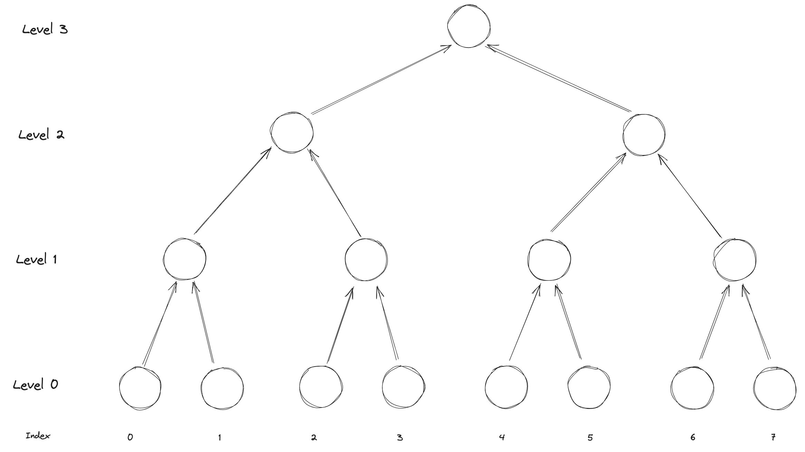
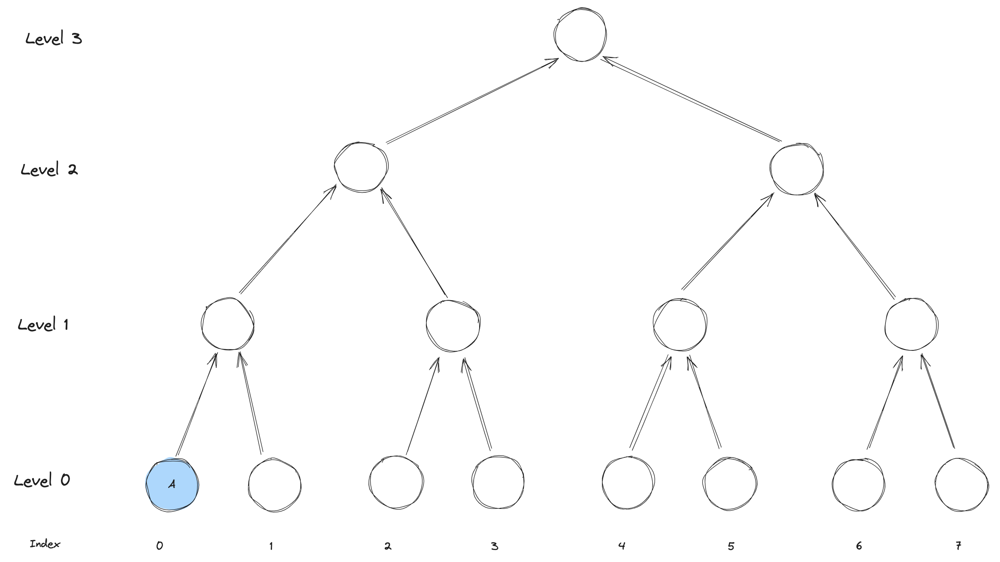
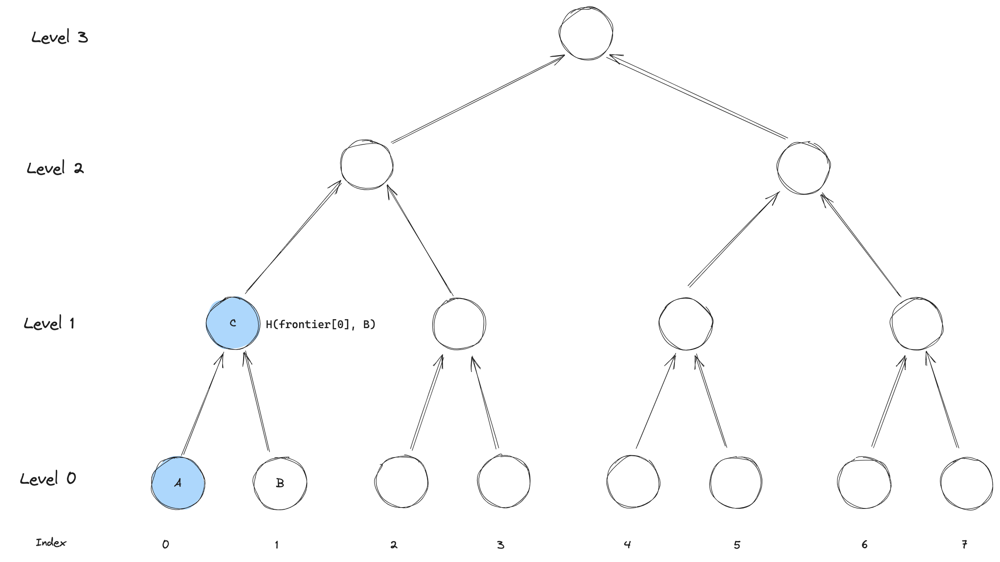
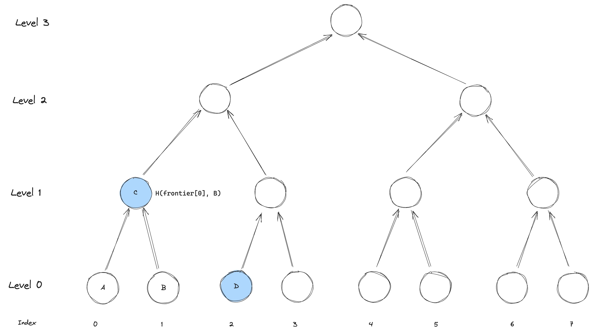
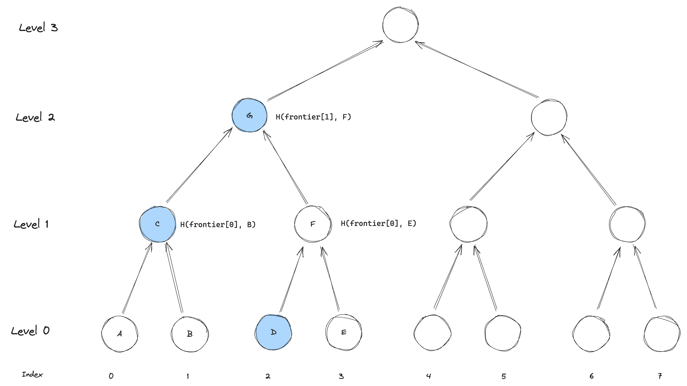
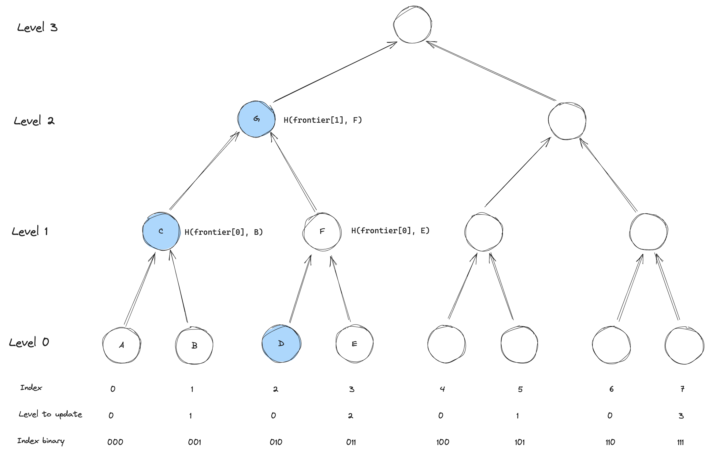
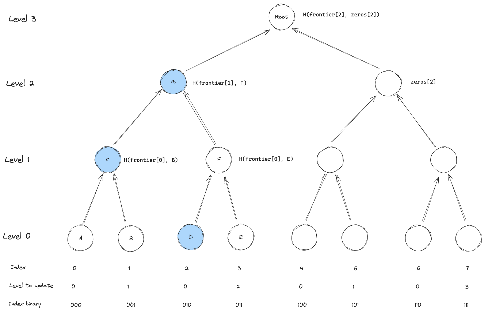

The Frontier Merkle Tree is an append only Merkle tree that is optimized for minimal storage on chain.
By storing only the right-most non-empty node at each level of the tree we can always extend the tree with a new leaf or compute the root without needing to store the entire tree.
We call these values the frontier of the tree.
If we have the next index to insert at and the current frontier, we have everything needed to extend the tree or compute the root, with much less storage than a full merkle tree. 
Note that we're not actually keeping track of the data in the tree: we only store what's minimally required in order to be able to compute the root after inserting a new element.

We will go through a few diagrams and explanations to understand how this works.
And then a pseudo implementation is provided.


## Insertion
Whenever we are inserting, we need to update the "root" of the largest subtree possible.
This is done by updating the node at the level of the tree, where we have just inserted its right-most descendant.
This can sound a bit confusing, so we will go through a few examples. 

At first, say that we have the following tree, and that it is currently entirely empty.



### The first leaf

When we are inserting the first leaf (lets call it A), the largest subtree is that leaf value itself (level 0).
In this case, we simply need to store the leaf value in `frontier[0]` and then we are done.
For the sake of visualization, we will be drawing the elements in the `frontier` in blue.



Notice that this will be the case whenever we are inserting a leaf at an even index.

### The second leaf

When we are inserting the second leaf (lets call it B), the largest subtree will not longer be at level 0.
Instead it will be level 1, since the entire tree below it is now filled!
Therefore, we will compute the root of this subtree, `H(frontier[0],B)` and store it in `frontier[1]`.

Notice, that we don't need to store the leaf B itself, since we won't be needing it for any future computations.
This is what makes the frontier tree efficient - we get away with storing very little data.



### Third leaf
When inserting the third leaf, we are again back to the largest subtree being filled by the insertion being itself at level 0.
The update will look similar to the first, where we only update `frontier[0]` with the new leaf.



### Fourth leaf

When inserting the fourth leaf, things get a bit more interesting.
Now the largest subtree getting filled by the insertion is at level 2.

To compute the new subtree root, we have to compute `F = H(frontier[0], E)` and then `G = H(frontier[1], F)`.  
G is then stored in `frontier[2]`.


As before, notice that we are only updating one value in the frontier. 


## Figuring out what to update

To figure out which level to update in the frontier, we simply need to figure out what the height is of the largest subtree that is filled by the insertion.
While this might sound complex, it is actually quite simple. 
Consider the following extension of the diagram.
We have added the level to update, along with the index of the leaf in binary.
Seeing any pattern?



The level to update is simply the number of trailing ones in the binary representation of the index.
For a binary tree, we have that every `1` in the binary index represents a "right turn" down the tree. 
Walking up the tree from the leaf, we can simply count the number of right turns until we hit a left-turn.

## How to compute the root

Computing the root based on the frontier is also quite simple. 
We can use the last index inserted a leaf at to figure out how high up the frontier we should start.
Then we know that anything that is at the right of the frontier has not yet been inserted, so all of these values are simply "zeros" values. 
Zeros here are understood as the root for a subtree only containing zeros.

For example, if we take the tree from above and compute the root for it, we would see that level 2 was updated last.
Meaning that we can simply compute the root as `H(frontier[2], zeros[2])`.



For cases where we have built further, we simply "walk" up the tree and use either the frontier value or the zero value for the level.

## Pseudo implementation
```python
class FrontierTree:
  HEIGHT: immutable(uint256)
  SIZE: immutable(uint256)

  frontier: HashMap[uint256, bytes32] # level => node
  zeros: HashMap[uint256, uint256] # level => root of empty subtree of height level

  next_index: uint256 = 0

  # Can entirely be removed with optimizations
  def __init__(self, _height_: uint256):
    self.HEIGHT = _height
    self.SIZE = 2**_height
    # Populate zeros

  def compute_level(_index: uint256) -> uint256:
    '''
    We can get the right of the most filled subtree by 
    counting the number of trailing ones in the index
    '''
    count = 0
    x = _index
    while (x & 1 == 1):
      count += 1
      x >>= 1
    return count

  def root() -> bytes32:
    '''
    Compute the root of the tree
    '''
    if self.next_index == 0:
      return self.zeros[self.HEIGHT]
    elif self.next_index == SIZE:
      return self.frontier[self.HEIGHT]
    else:
      index = self.next_index - 1
      level = self.compute_level(index)

      temp: bytes32 = self.frontier[level]

      bits = index >> level
      for i in range(level, self.HEIGHT):
        is_right = bits & 1 == 1
        if is_right:
          temp = sha256(frontier[i], temp)
        else:
          temp = sha256(temp, self.zeros[i])
        bits >>= 1
      return temp

  def insert(self, _leaf: bytes32):
    '''
    Insert a leaf into the tree
    '''
    level = self.compute_level(next_index)
    right = _leaf
    for i in range(0, level):
      right = sha256(frontier[i], right)
    self.frontier[level] = right
    self.next_index += 1
```

## Optimizations
- The `zeros` can be pre-computed and stored in the `Inbox` directly, this way they can be shared across all of the trees.


