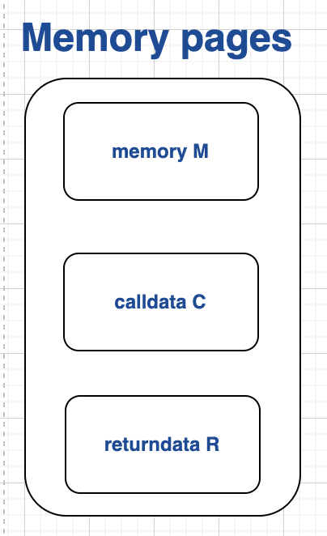

# The Aztec VM State Model

The goal of this note is to describe the VM state model and to specify "internal" VM abstractions that can be mapped to circuit designs.

# A memory-only state model

The AVM possesses three distinct data regions, accessed via distinct VM instructions: memory, calldata and returndata

All data regions are linear blocks of memory where each memory cell stores a finite field element.

#### Main Memory

Main memory stores the internal state of the current program being executed.
Can be written to as well as read.

The main memory region stores _type tags_ alongside data values. [Type tags are explained further on in this document](#type tags).

#### Calldata

Read-only data structure that stores the input data when executing a public function.

#### Returndata

When a function is called from within the public VM, the return parameters of the called function are present in returndata.

### Registers (and their absence in the AVM)

The AVM does not have external registers. i.e. a register that holds a persistent value that can be operated on from one opcode to the next.

For example, in the x86 architecture, there exist 8 registers (%rax, %rbx etc). Instructions can operate either directly on register values (e.g. `add %rax %rbx`) or on values in memory that the register values point to (e.g. `add (%rax) (%rbx)`).

> The AVM does not support registers as this would require each register to exist as a column in the VM execution trace. "registers" can be implemented as a higher-level abstraction by a compiler producing AVM bytecode, by reserving fixed regions of memory to represent registers.

### Memory addressing mode

In the AVM, an instruction operand `X` can refer to one of three quantities:

1. A literal value `X`
2. A memory address `M[X]`
3. An indirect memory address `M[M[X]]`

Indirect memory addressing is required in order to support read/writes into dynamically-sized data structures (the address parameter `X` is part of the program bytecode, which is insufficient to describe the location in memory of a dynamically-sized data structure).

Memory addresses must be tagged to be a `u32` type.

See [here](./tagged-memory) for more information on types and the VM's tagged memory model.
