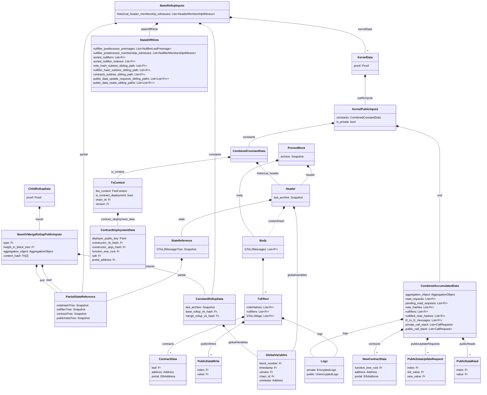

An introduction to the Base Rollup circuit. The base circuit is the most complex of the rollup circuits, as it have to deal with the kernels and perform the state updates and transaction validation.

## Overview

Below is a subset of the figure from earlier (granted, not much is removed). The figure shows the data structures related to the Base Rollup circuit.

### Inputs

| Field | Type | Description | Provided by |
|----------|----------|----------|----------|
| KernelData | KernelData[] | Kernel data for the two transactions being merged. Sequencer helps with public execution + global variables| Users (+ help from sequencer) |  
| StartNoteHashTreeSnapshot | AppendOnlyTreeSnapshot | Snapshot of the note hash tree at the start of the two transactions | Sequencer |
| StartNullifierTreeSnapshot | AppendOnlyTreeSnapshot | Snapshot of the nullifier hash tree at the start of the two transactions | Sequencer |
| StartContractTreeSnapshot | AppendOnlyTreeSnapshot | Snapshot of the contract tree at the start of the two transactions | Sequencer |
| StartPublicDataTreeRoot | Field | Root of the public data tree at the start of the two transactions | Sequencer |
| StartL1ToL2MessagesTreeSnapshot | AppendOnlyTreeSnapshot | Snapshot of the L1 to L2 messages tree at the start of the two transactions | Sequencer |
| StartBlocksTreeSnapshot | AppendOnlyTreeSnapshot | Snapshot of the blocks tree at the start of the two transactions | Sequencer |
| SortedNewNullifiers | Field[] | Sorted list of new nullifiers | Sequencer |
| SortedNewNullifiersIndexes | Field[] | Sorted list of new nullifiers indexes | Sequencer |
| LowNullifierLeafPreimages | NullifierLeafPreimage[] | Low nullifier leaf preimages | Sequencer |
| LowNullifierMembershipWitness | MembershipWitness[] | Low nullifier membership witness | Sequencer |
| NewNoteHashSubtreeSiblingPath | SiblingPath | Sibling path for the new note hash subtree | Sequencer |
| NewNullifierSubtreeSiblingPath | SiblingPath | Sibling path for the new nullifier subtree | Sequencer |
| NewContractSubtreeSiblingPath | SiblingPath | Sibling path for the new contract subtree | Sequencer |
| NewPublicDataUpdateRequestsSiblingPaths | SiblingPath[] | Sibling paths for the new public data update requests | Sequencer |
| PublicDataReadsSiblingPaths | SiblingPath[] | Sibling paths for the public data reads | Sequencer |
| BlocksTreeRootMembershipWitnesses | MembershipWitness[] | Membership witnesses for the blocks tree root, one for each kernel | Sequencer |
| Constants | ConstantRollupData | Data that is consistent for all transactions in the block such as verification keys, parent block and global variables | Sequencer |

:::warning
- Are the `sorted_new_nullifiers` expected to be sorted, where is it then checked that they are sorted? And where is it sorted? What is the reasoning for them being sorted? -> Seems like the permutation is checked inside the `batch_insert` function. Sorted to make the strategy simpler for the batch-insertion.
- Why are the public reads called new in the code?
- Needs to have their names reconsidered @benesjan might have some ideas.
  - `BlocksTreeRootMembershipWitnesses`
  - `ConstantRollupData.start_blocks_tree_snapshot`
:::

### Public Inputs (outputs)
| Field | Type | Description |
|----------|----------|----------|
| RollupType | Field | Type of the rollup: (merge, base or root) |
| RollupSubtreeHeigh| Field | The height of in the block subtree, `base = 0` |
| AggregationObject | AggregationObject | Aggregated proof of all the previous kernel iterations. |
| Constants | ConstantRollupData | Data that is consistent for all transactions in the block such as verification keys, parent block and global variables | 
| StartNoteHashTreeRoot | Field | Root of the note hash tree at the start of the two transactions |
| EndNoteHashTreeRoot | Field | Root of the note hash tree at the end of the two transactions |
| StartNullifierTreeRoot | Field | Root of the nullifier tree at the start of the two transactions |
| EndNullifierTreeRoot | Field | Root of the nullifier tree at the end of the two transactions |
| StartContractTreeRoot | Field | Root of the contract tree at the start of the two transactions |
| EndContractTreeRoot | Field | Root of the contract tree at the end of the two transactions |
| StartPublicDataTreeRoot | Field | Root of the public data tree at the start of the two transactions |
| EndPublicDataTreeRoot | Field | Root of the public data tree at the end of the two transactions |
| ContentHash | Sha256 | Hash of the transaction data | 

:::info Content Hash
Fill in the computation of this. The short explanation is that it is SHA256 hash of the state diff caused by the transactions in the base.
:::

### Validity Conditions

- **Individual Transaction Validity**: For each of the 2 transaction in the base:
  - Kernel Proof MUST be valid (there is 1 aggregated kernel proof per transaction)
  - `chainid` used in kernel proof MUST match `constants.globalVariables.chainid`
  - `version` used in kernel proof MUST match `constants.globalVariables.version`
  - Pending private call stack MUST be empty and pending public call stack MUST be empty
  - Check the block header used by each kernel is a member of the blocks tree.
  - The `maxBlockNum` MUST be smaller or equal to the `constants.globalVariables.block_number`
  - The `constants` in `BaseRollupInputs` MUST be equal to the `KernelData.constants`
  - **Public State**:
    - Reads and writes MUST be ordered by causality, e.g., reading after a write MUST return the value written
  - The provided `header` MUST be in the `blocksTree`. THIS NAMING GOTTA BE FIXED.
- **Aggregate proof**: Must aggregate the two proofs into a single proof
- **State Manipulation**: All state changes are grouped into a single ref
  - New contract deployments:
    - For each new contract, the preimage is hashed to compute the leaf that will be inserted into the contracts tree (`hash(kernel_data.public_inputs.end.new_contracts[i])`)
    - if no new contracts, a zero leaf (not hash of zero) is inserted
    - a merkle tree is created with all the leaves
    - this subtree gets added to the `StartContractTreeSnapshot` to generate `EndContractTreeSnapshot`
      - to add, use `NewContractSubtreeSiblingPath` provided in BaseRollupInputs
      - `NewContractSubtreeSiblingPath` MUST be of same length as the height of the subtree 
      - `StartContractTreeSnapshot` at the index of insertion of subtree MUST be empty (since we insert a subtree, check that the value at the subtree index is equivalent of an empty subtree)
      - compute new root against the sibling path
      - Compute `NewNextAvailableLeafIndex` to be 2 ^ subtree depth + `StartContractTreeSnapshot.NextAvailableLeafIndex`
      - Create `EndContractTreeSnapshot` = {new root, NewNextAvailableLeafIndex}
  - New note hashes:
    - Number of new notes in each kernel MUST be equal to `MAX_NEW_COMMITMENTS_PER_TX`
    - A Merkle tree is created with all the notes as leaves
    - This subtree gets added to the `StartNoteTreeSnapshot` to generate `EndNoteTreeSnapshot`
      - To add, use `NewNoteSubtreeSiblingPath` provided in BaseRollupInputs
      - `NewNoteSubtreeSiblingPath` MUST be of the same length as the height of the subtree
      - `StartNoteTreeSnapshot` at the index of insertion of subtree MUST be empty (since we insert a subtree, check that the value at the subtree index is equivalent of an empty subtree)
      - Compute new root against the sibling path
      - Compute `NewNextAvailableLeafIndex` to be 2 ^ subtree depth + `StartNoteTreeSnapshot.NextAvailableLeafIndex`
    - Create `EndNoteTreeSnapshot` = {new root, NewNextAvailableLeafIndex}
  - New nullifiers:
    - Number of new notes in each kernel MUST be equal to `MAX_NEW_NULLIFIERS_PER_TX`
    - Batch insert the new nullifiers and check for non inclusion for each. In general, to batch insert items:
      - We first need to update their low nullifier to point to them,
      - Then batch insert all of the values at once in the final step.
      - Before updating a low nullifier, we must provide an insertion proof that the low nullifier currently exists in the tree.
      - Updating this low nullifier will change the root of the tree. Therefore future low nullifier insertion proofs must be given against this new root.
      - As a result, each low nullifier membership proof will be provided against an intermediate tree state, each with differing roots. 
      - This become tricky when two items that are being batch inserted need to update the same low nullifier, or need to use a value that is part of the same batch insertion as their low nullifier.
      - We can avoid this case by always updating the existing leaves in the tree with the nullifiers in high to low order i.e. circuit needs the sorted nullifiers. 
      - Sorted nullifiers MUST be sorted and a permutation of the new nullifiers
      - For each of the sorted nullifier:
        - Skip if nullifier is 0
        - Otherwise, check for non inclusion. Assert that 
          - `lowNullifier` is not 0 and 
          - `lowNullifier.leafValue < nullifier` and 
          - `nullifer > lowNullifier.nextValue` or (`lowNullifier.nextIndex` is 0 and  `lowNullifier.nextValue` is 0)
        - check that `lowNullifier` exist in the `StartNullifierTreeSnapshot` (i.e. do a inclusion proof for `lowNullifier`)
        - Update `lowNullifier` to point to the sorted nullifier (`lowLeaf.nextValue = sortedNullifier` and `lowLeaf.nextIndex` = sortedNullifierIndex)
      - Create a subtree with all the new nullifier leaves
      - Insert subtree into the nullifier tree
      - Compute `NewNextAvailableLeafIndex` as `StartNullifierTreeSnapshot.NextAvailableLeafIndex + sorted_nullifiers.length`  
      - Create `EndNullifierTreeSnapshot` as {new root, `NewNextAvailableLeafIndex`}
  - Public data reads and updates:
    - Validate all public data reads (i.e. the value passed by the sequencer is same as stored in the merkle tree) - 
      - It isn't enough to check that the read exists not just in `StartPublicDataTreeRoot`, because data can be created in a transaction and read in that transaction. Hence, the reads should be validated against the current state of the transaction and not at the start state.
:::warning
It is unclear how we do this at the current moment.
:::
    - For each public data update request, if request is non-zero, add to tree against the sibling path provided in `NewPublicDataUpdateRequestsSiblingPaths`
    - Create `EndPublicDataTreeRoot` as the final root after adding all the public data update requests.
- **ContentHash**: The content hash MUST be equal to the hash of the state diff caused by the transactions.
  - TODO: Wait on Lasse...
