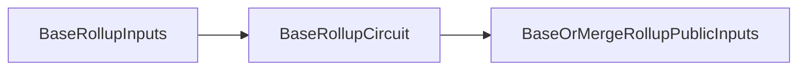
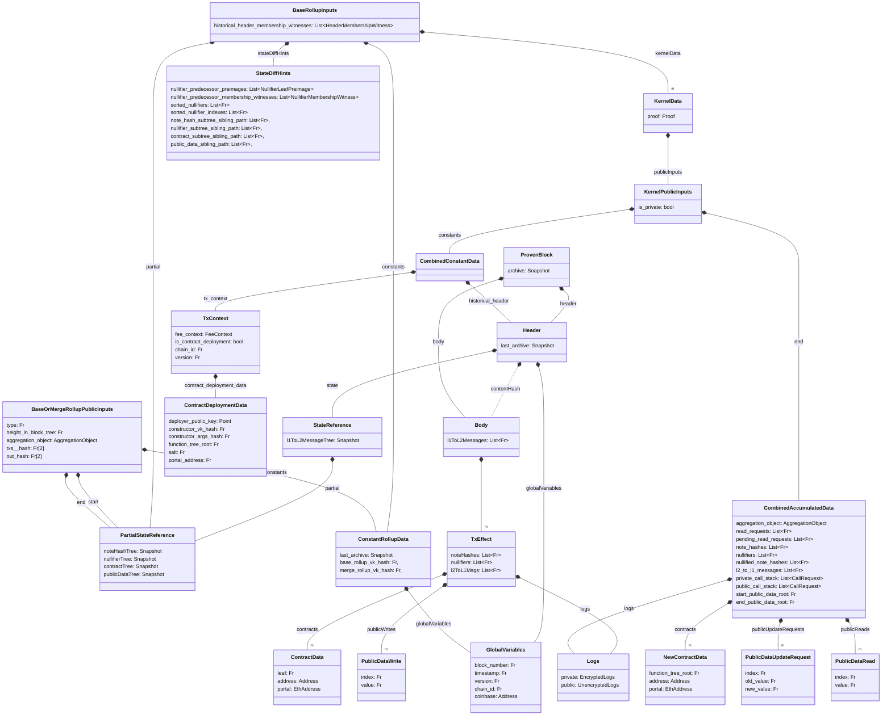

The base circuit is the most complex of the rollup circuits, as it have to deal with the kernels and perform the state updates and transaction validation. While this makes the data structures complex to follow, the goal of the circuit is fairly straight forward: 

Take `BaseRollupInputs` as an input value, and transform it to `BaseOrMergeRollupPublicInputs` as an output value while making sure that the validity conditions are met.



## Overview

Below is a subset of the figure from earlier (granted, not much is removed). The figure shows the data structures related to the Base Rollup circuit.



### Validity Conditions

```python
def BaseRollupCircuit(
  state_diff_hints: StateDiffHints,
  historical_header_membership_witnesses: HeaderMembershipWitness[],
  kernel_data: KernelData[],
  partial: PartialStateReference,
  constants: ConstantRollupData,
) -> BaseOrMergeRollupPublicInputs:

  tx_hashes = Fr[][2]
  contracts = Fr[]
  public_data_tree_root = partial.public_data_tree
  for i in len(kernel_data):
    tx_hash, _c, public_data_tree_root = kernel_checks(
      kernel_data[i], 
      constants, 
      public_data_tree_root,
      historical_header_membership_witnesses[i],
    )
    tx_hashes.push(tx_hash)
    contracts.push_array(_c)

  note_hash_subtree = MerkleTree(
    [...note_hashes for kernel_data.public_inputs.end.note_hashes in kernel_data]
  )
  note_hash_snapshot = merkle_insertion(
    partial.note_hash_tree.root,
    note_hash_subtree.root,
    state_diff_hints.note_hash_subtree_sibling_path,
    NOTE_HASH_SUBTREE_HEIGHT,
    NOTE_HASH_TREE_HEIGHT,
  )

  # We can use the sorted nullifiers to simplify batch-insertion
  # The sorting can be checked with a permutation 
  nullifier_snapshot = successor_merkle_batch_insertion(
    partial.nullifier_tree.root,
    [...nullifiers for kernel_data.public_inputs.end.nullifiers in kernel_data],
    state_diff_hints.sorted_nullifiers,
    state_diff_hints.sorted_nullifier_indexes,
    state_diff_hints.nullifier_subtree_sibling_path,
    state_diff.nullifier_predecessor_preimages,
    state_diff.nullifier_predecessor_membership_witnesses,
    NULLIFIER_SUBTREE_HEIGHT,
    NULLIFIER_TREE_HEIGHT,
  )

  contract_sub_tree = MerkleTree(contracts)
  contract_snapshot = merkle_insertion(
    partial.note_hash_tree.root,
    note_hash_subtree.root,
    state_diff_hints.contract_subtree_sibling_path,
    CONTRACTS_SUBTREE_HEIGHT,
    CONTRACTS_TREE_HEIGHT,
  )

  txs_hash = SHA256(tx_hashes)
  out_hash = SHA256(
    [...l2_to_l1_messages for kernel_data.public_inputs.end.l2_to_l1_messages in kernel_data]
  )

  return BaseOrMergeRollupPublicInputs(
    type=0,
    height_in_block_tree=0,
    aggregation_object=
    txs_hash=txs_hash
    out_hash=out_hash
    start=partial,
    end=PartialStateReference(
      note_hash_tree=note_hash_snapshot,
      nullifier_tree=nullifier_snapshot,
      contract_tree=contract_snapshot,
      public_data_tree=public_data_tree_root,
    ),
  )

def kernel_checks(
  kernel: KernelData, 
  constants: ConstantRollupData, 
  public_data_tree_root: Fr,
  historical_header_membership_witness: HeaderMembershipWitness
) -> (Fr[2], Fr[], Fr):
  assert public_data_tree_root == kernel.public_inputs.end.start_public_data_root
  assert kernel.proof.verify(kernel.public_inputs)

  tx_context = kernel.public_inputs.constants.tx_context
  assert tx_context.chainid == constants.globalVariables.chainid
  assert tx_context.version == constants.globalVariables.version

  assert len(kernel.public_inputs.end.private_call_stack) == 0
  assert len(kernel.public_inputs.end.public_call_stack) == 0

  assert merkle_inclusion(
    kernel.constants.historical_header.hash(), 
    kernel.constants.historical_header.global_variables.block_number, 
    historical_header_membership_witness, 
    constants.last_archive
  )

  contracts = []
  contract_datas = []
  for preimage in kernel.public_inputs.end.contracts:
    to_push = preimage.hash() if preimage.address == 0 else 0:
    contracts.push(to_push)
    contract_datas.push(ContractData(to_push, preimage.address, preimage.portal))

  tx_hash = SHA256(
    kernel.public_inputs.end.note_hashes |
    kernel.public_inputs.end.nullifiers |
    contract_datas | 
    kernel.public_inputs.end.public_data_writes |
    kernel.public_inputs.end.l2_to_l1_messages
  )
  return (tx_hash, contracts, kernel.public_inputs.end.end_public_data_root)

def handle_public_state(
  kernel: KernelData, 
  public_data_tree: Snapshot, 
  state_diff_hints: StateDiffHints
):
  # Here there should be logic to handle the public state changes. 
  # The logic should ensure causal ordering, e.g.,
  # When reading a value, it must return the last value written

```