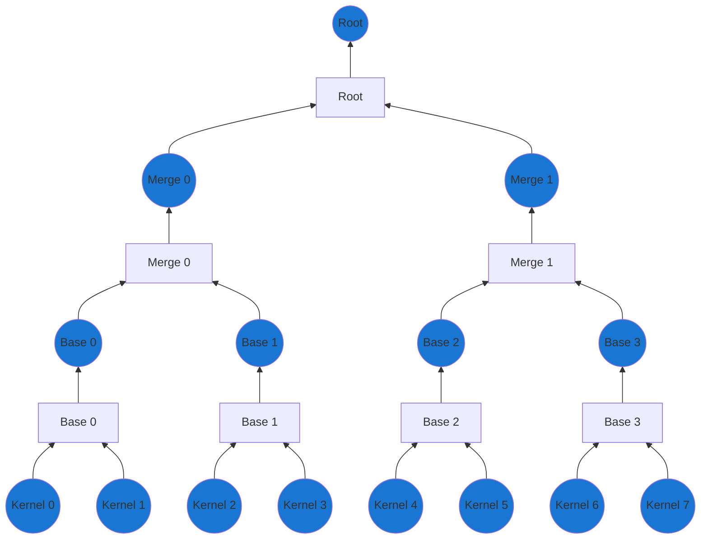
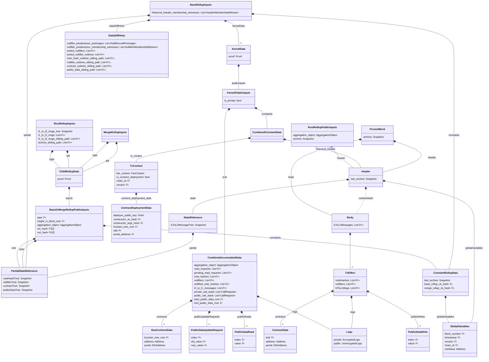
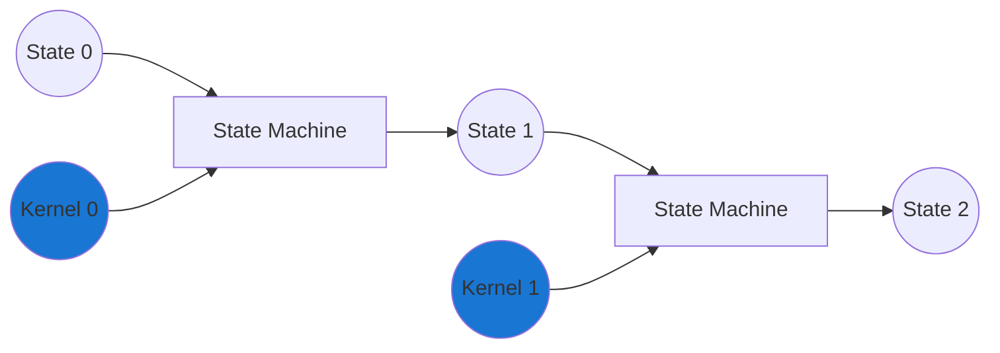
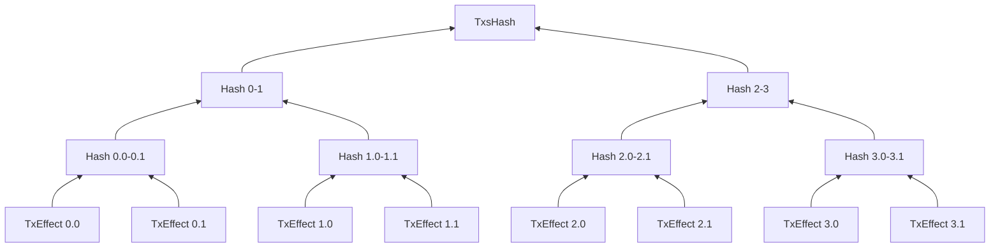
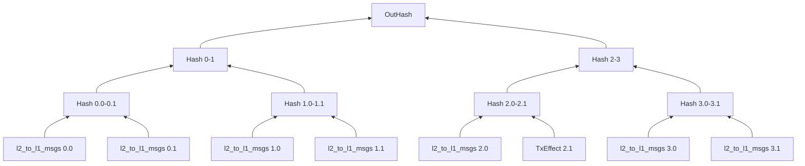

## Overview

Together with the [validating light node](./../contracts/index.md) the rollup circuits is was must ensure that incoming blocks are valid, that state is progressed correctly and that anyone can rebuild the state.

To support this, we construct a single proof for the entire block, which is then verified by the validating light node. This single proof is constructed by recursively merging proofs together in a binary tree structure. This structure  allows us to keep the workload of the individual proof small, while making it very parallelizable. This works very well for case where we want many actors to be able to participate in the proof generation.

The tree structure is outlined below, but the general idea is that we have a tree where all the leaves are transactions (kernel proofs) and through $\log n$ steps we can then "compress" them down to just a single root proof. Note that we have three (3) different types of "merger" circuits, namely:
- The base rollup
  - Merges two kernel proofs
- The merge rollup
  - Merges two base rollup proofs OR two merge rollup proofs
- The root rollup
  - Merges two merge rollup proofs 

In the diagram the size of the tree is limited for show, but a larger tree will have more layers of merge rollups proofs. Circles mark the different types of proofs, while squares mark the different circuit types.



To understand what the circuits are doing and what checks they need to apply it is useful to understand what data is going into the circuits and what data is coming out. 

Below is a figure of the data structures thrown around for the block proof creation. Note that the diagram does not include much of the operations for kernels, but mainly the data structures that are used for the rollup circuits.



:::info CombinedAccumulatedData
Note that the `CombinedAccumulatedData` contains elements that we won't be using throughout the rollup circuits. However, as the data is used for the kernel proofs (when it is build recursively), we will include it here anyway.
:::

Since the diagram can be quite overwhelming, we will go through the different data structures and what they are used for along with the three (3) different rollup circuits.

### Higher-level tasks
Before looking at the circuits individually, it can however be a good idea to recall the reason we had them in the first place. For this, we are especially interested in the tasks that goes across multiple circuits and proofs.

#### State consistency
While the individual kernels are validated on their own, they might rely on state changes earlier in the block. For the block to be correctly validated, this means that when validating kernel $n$, it must be executed on top of the state after all kernels $<n$ have been applied. For example, when kernel $3$ is executed, it must be executed on top of the state after kernel $0$, $1$ and $2$ has been applied. If this is not the case, the kernel proof might be valid, but the state changes invalid which could lead to double spends. 

It is therefore of the highest importance that the circuits ensure that the state is progressed correctly across circuit types and proofs. Logically, taking a few of the kernels from the above should be executed/proven as butchered below, $k_n$ applied on top of the state that applied $k_{n-1}$



#### State availability
To ensure that state is made available, we could rely on the full block body as public inputs, but this would be very expensive. Instead we rely on a commitment to the body (the `ContentHash`) which we build upon throughout proof generation as needed.

To check that this body is published a node can reconstruct the `ContentHash` from available data. Since we define finality as the point where the block is validated and included in the state of the [validating light node](./../contracts/index.md), we can define "available" at the level of this node, e.g., if the validating light node can reconstruct the commitment then it is available.

Since we strive to minimize the compute requirements to prove blocks, we amortize the commitment cost across the full three. We can do so by building merkle trees of partial "commitments" that are then finished at the root. Below, we outline the `TxsHash` merkle tree that is based on the `TxEffect`s and a `OutHash` which is based on the `l2_to_l1_msgs` (cross-chain messages) for each transaction. While the `TxsHash` implicitly include the `l2_to_l1_msgs` we construct it separately since the `l2_to_l1_msgs` must be known to the contract directly and not just proven available. This is not a concern when using calldata as the data layer, but is a concern when using alternative data layers such as [Celestia](https://celestia.org/) or [Blobs](https://eips.ethereum.org/EIPS/eip-4844).






 The roots of these tree together with incoming messages makes up the `ContentHash`. 
```python
def content_hash(body: Body):
    txs_hash = merkle_tree(body.txs, SHA256).root
    out_hash = merkle_tree([tx.l1_to_l2_msgs for tx in body.txs], SHA256).root
    in_hash = SHA256(body.l1_to_l2_messages)
    return SHA256(txs_hash, out_hash, in_hash)
```

:::info SHA256
SHA256 is used since as the hash function since it will likely be reconstructed outside the circuit in a resource constrained environment (Ethereum L1).
:::

## Next Steps

import DocCardList from '@theme/DocCardList';

<DocCardList />