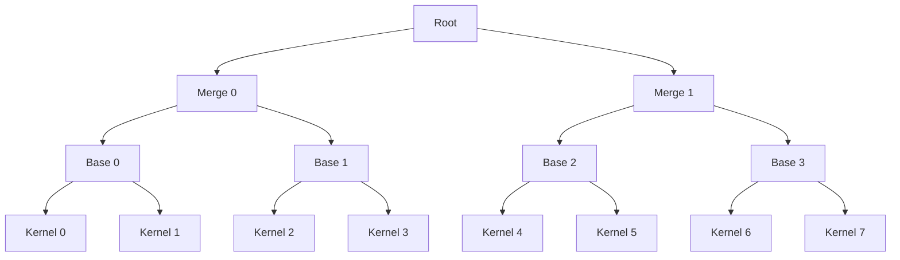
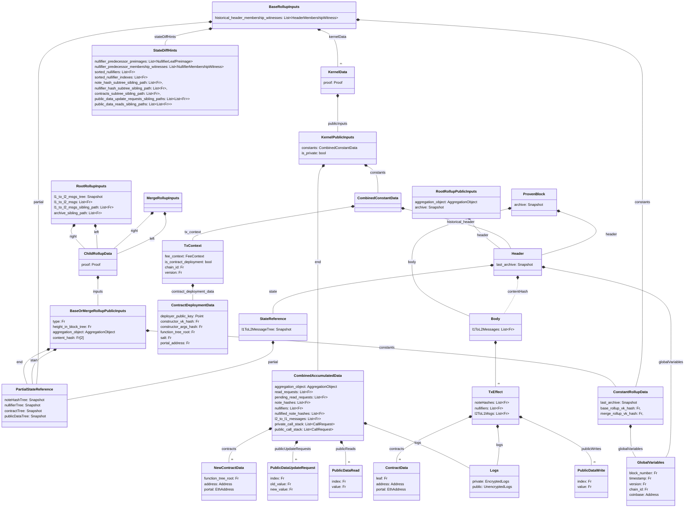

:::warning
This part is not yet complete, only just started. I'm considering whether to create some of the types that @benesjan and I discussed to improve clarity on the snapshots etc a bit more. Should make it a bit easier to follow what is going on.
:::

## Overview

Our block proofs are build in a binary tree structure, rolling two proofs into one at every layer. This rolling allows us to keep the workload of the individual proof small, while making it very parallelizable. This works very well for case where we want many actors to be able to participate in the proof generation.

The tree structure is outlined below, but the general idea is that we have a tree where all the leafs are transactions (kernel proofs) and through $\log n$ steps we can then "compress" it down to just a single root proof. Note that we have three (3) different types of "merger" circuits, namely:
- The base rollup
  - Merges two kernel proofs
- The merge rollup
  - Merges two base rollup proofs OR two merge rollup proofs
- The root rollup
  - Merges two merge rollup proofs 

In the diagram the size of the tree is limited for show, but a larger tree will have more layers of merge rollups proofs.

To understand what the circuits are doing and what checks they need to apply it is useful to understand what data is going into the circuits and what data is coming out. Below is a figure of the data structures thrown around for the block proof creation. Note that the diagram does not include much of the operations for kernels, but mainly the data structures that are used for the rollup circuits.

Since the diagram can be quite overwhelming, we will go through the different data structures and what they are used for along with the three (3) different rollup circuits.

import DocCardList from '@theme/DocCardList';

<DocCardList />

### Types

## Merge Rollup

## Root Rollup
The root rollup output (public inputs) will be the values that make their way onto the validating light node, see **REFERENCE** for more. 

### Updating trees Algorithm gives 
- Given a list of leaves to add, create a Merkle tree of them
- This subtree must be  added to the `StartTreeSnapshot` to generate `EndTreeSnapshot`
  - To add, use `NewSubtreeSiblingPath` provided in BaseRollupInputs for each of the trees (Contract Tree, Note Hash tree etc.)
  - `NewSubtreeSiblingPath` MUST be of same length as the height of the subtree 
  - `StartTreeSnapshot` at the index of insertion of subtree MUST be empty (since we insert a subtree, check that the value at the subtree index is equivalent of an empty subtree)
  - compute new root against the sibling path
  - Compute `NewNextAvailableLeafIndex` to be 2 ^ subtree depth + `StartContractTreeSnapshot.NextAvailableLeafIndex`
  - Create `EndContractTreeSnapshot` = {new root, NewNextAvailableLeafIndex}