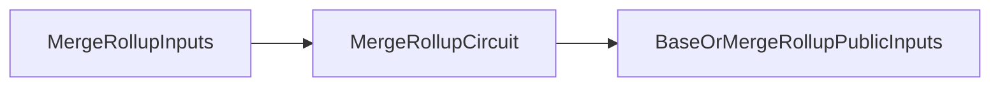
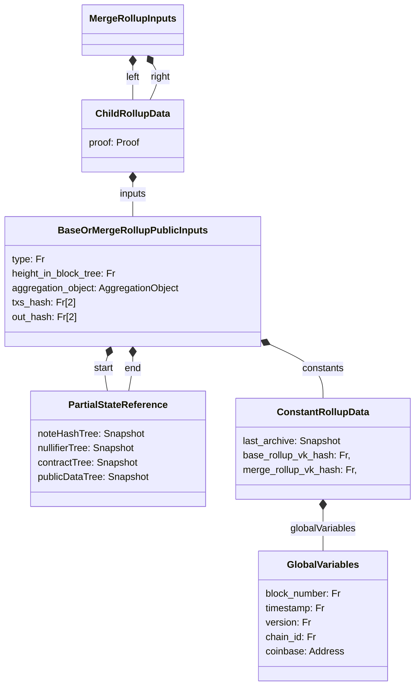

The Merge rollup circuit is our in-between circuit, it don't need to perform any state updates, but mainly check the consistency of its inputs.



## Overview

Below is a subset of the data structures figure from earlier for easy reference.



### Validity Conditions

```python
def MergeRollupCircuit(
    left: ChildRollupData, 
    right: ChildRollupData
) -> BaseOrMergeRollupPublicInputs:
    assert left.proof.is_valid(left.inputs)
    assert right.proof.is_valid(right.inputs)

    assert left.inputs.constants == right.inputs.constants
    assert right.inputs.start == left.inputs.end
    assert left.inputs.type == right.inputs.type
    assert left.inputs.height_in_block_tree == right.inputs.height_in_block_tree

    return BaseOrMergeRollupPublicInputs(
        type=1,
        height_in_block_tree=left.inputs.height_in_block_tree + 1,
        aggregation_object=AggregationObject(left.proof, right.proof),
        txs_hash=SHA256(left.inputs.txs_hash | right.inputs.txs_hash),
        out_hash=SHA256(left.inputs.txs_hash | right.inputs.out_hash),
        start=left.inputs.start,
        end=right.inputs.end,
        constants=left.inputs.constants
    )
```