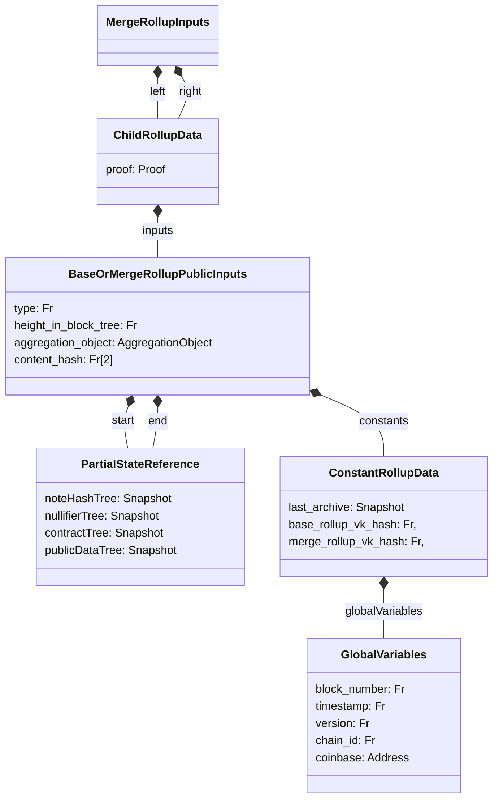

An introduction to the Merge Rollup circuit. 

## Overview

Below is a subset of the figure from earlier (granted, not much is removed)

```mermaid
classDiagram
direction TB


class PartialStateReference {
    noteHashTree: Snapshot
    nullifierTree: Snapshot
    contractTree: Snapshot
    publicDataTree: Snapshot
}

class GlobalVariables {
    block_number: Fr
    timestamp: Fr
    version: Fr
    chain_id: Fr
    coinbase: Address
}

class ConstantRollupData {
  last_archive: Snapshot
  base_rollup_vk_hash: Fr,
  merge_rollup_vk_hash: Fr,
}
ConstantRollupData *-- GlobalVariables : globalVariables

class BaseOrMergeRollupPublicInputs {
    type: Fr
    height_in_block_tree: Fr
    aggregation_object: AggregationObject
    content_hash: Fr[2]
}
BaseOrMergeRollupPublicInputs *-- ConstantRollupData : constants
BaseOrMergeRollupPublicInputs *-- PartialStateReference : start
BaseOrMergeRollupPublicInputs *-- PartialStateReference : end

class ChildRollupData {
    proof: Proof
}
ChildRollupData *-- BaseOrMergeRollupPublicInputs: inputs

class MergeRollupInputs { }
MergeRollupInputs *-- ChildRollupData: left
MergeRollupInputs *-- ChildRollupData: right

```
