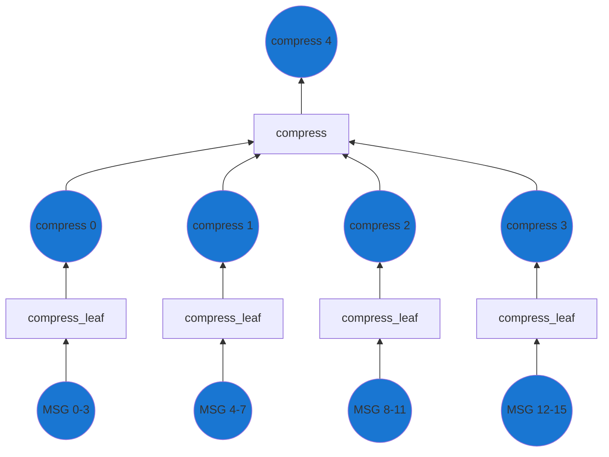
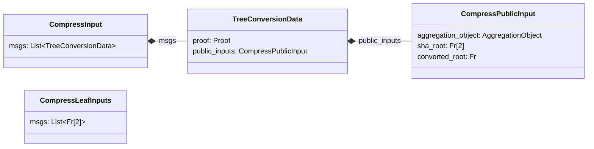

To support easy consumption of l1 to l2 messages inside the proofs, we need to convert the tree of messages to a snark-friendly format.

If you recall back in [L1 smart contracts](./../l1-smart-contracts/index.md#inbox) we were building a message tree on the L1.
We used SHA256 to compute the tree which is cheap to compute on L1.
As SHA256 is not snark-friendly, weak devices would not be able to prove inclusion of messages in the tree.

This circuit is responsible for converting the tree such that users can easily build the proofs.
We essentially use this circuit to front-load the work needed to prove the inclusion of messages in the tree.
As earlier we are using a tree-like structure.



Practically, this will be using two circuits, similar to how we have the `base` and `merge` circuits for transactions.
The output of the "combined" circuit will be the `converted_root` which is the root of the snark-friendly message tree.
And the `sha_root` which must match the root of the sha256 message tree from the L1 Inbox.
The circuit must simply compute the two trees using the same inputs, and then we ensure that the elements of the trees match the inbox later at the [state transitioner](./../l1-smart-contracts/index.md#overview).



The logic of the the circuits is quite simple.
They simply progress building of two trees, the SHA tree and the snark-friendly tree. 
For optimization purposes, it can be useful to have the layers take more than 2 inputs to increase the task of every layer.
If each just take 2 inputs, the overhead of recursing through the layers might be higher than the actual work done.
Recall that all the inputs are already chosen by the L1, so we don't need to worry about which to chose.

```python
def compress_leaf(msgs: List[Fr[2]]) -> CompressPublicInput:
    sha_root = MERKLE_TREE(msgs, SHA256);
    converted_root = MERKLE_TREE(msgs, SNARK_FRIENDLY_HASH_FUNCTION);
    return CompressPublicInput(sha_root, converted_root)

def compress(msgs: List[TreeConversionData]) -> CompressPublicInput:
    for msg in msgs:
        assert msg.proof.verify(msg.public_inputs);

    sha_root = MERKLE_TREE(
      [msg.public_inputs.sha_root for msg in msgs], 
      SHA256
    );
    converted_root = MERKLE_TREE(
      [msg.public_inputs.converted_root for msg in msgs], 
      SNARK_FRIENDLY_HASH_FUNCTION
    );
    return CompressPublicInput(sha_root, converted_root)
```


