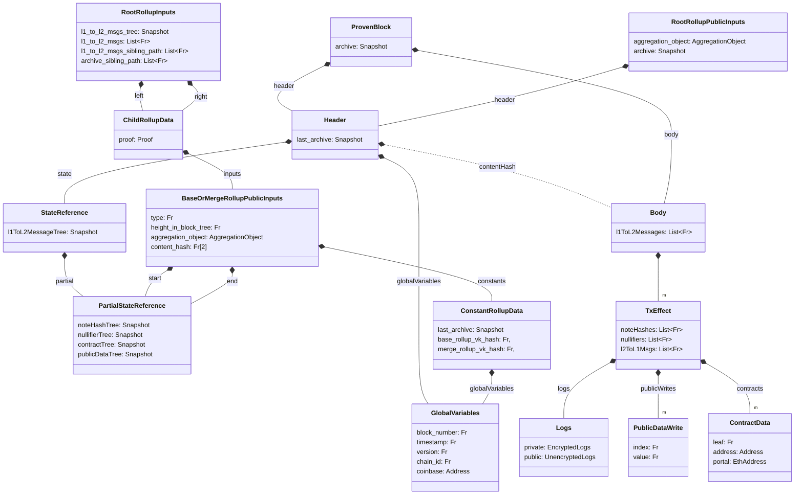

:::warning TODO
The L1 contract must compute the `contentHash` outside the circuits. Essentially, this must include the cross-chain messages and the transactions.
Must be updated for clarity in the contracts
:::