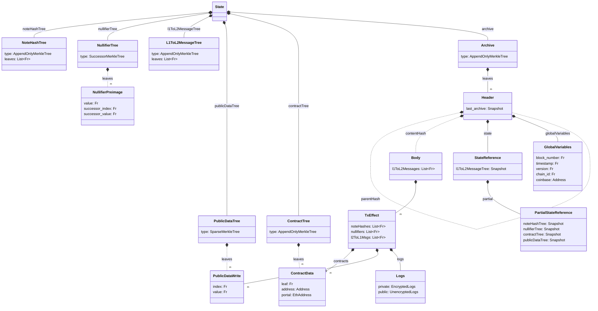

# Types

## State

## Overview
Below is a partial diagram of all the types and how they are connected. This is particularly interested in the data that go into and comes out of the rollup circuits and don't care particularly about the data for kernels right now.

