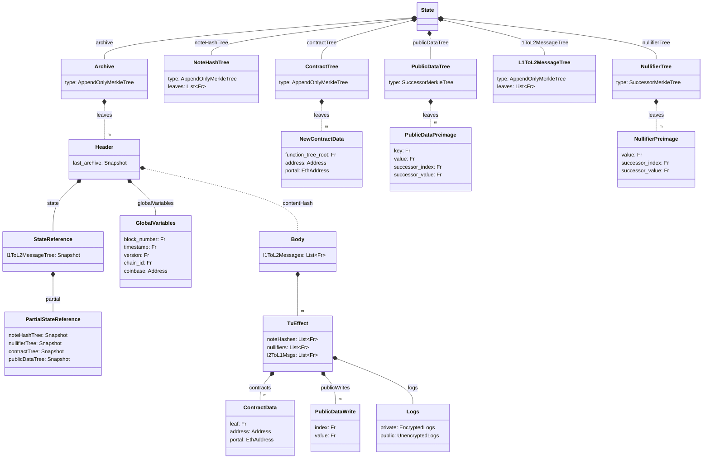

# State

Global state in the Aztec Network is represented by a set of Merkle trees: the [Note Hash tree](./note_hash_tree.md), [Nullifier tree](./nullifier_tree.md), and [Public Data tree](./public_data_tree.md) reflect the latest state of the chain, while the L1 to L2 message tree allows for [cross-chain communication](../contracts/#l2-outbox) and the [Archive](./archive.md) allow for historical state access.

Merkle trees are either 
- [append-only](./tree_impls.md#append-only-merkle-trees), for data where we only require inclusion proofs or 
- [indexed](./tree_impls.md#indexed-merkle-trees) for storing data that requires proofs of non-membership.

:::warning Discussion Point
We are using Successor merkle trees (also known as indexed) for data where we rely on proofs of non-membership. Do we want to support the same for the `noteHashTree` and the `l1ToL2MessageTree` as well? It is not used by the protocol circuits, but would let users more easily prove statements like "This note don't exists" or "This message was not included in the rollup". I'm not sure how useful this would be. But we should maybe consider if there are some use cases for this.
:::

import DocCardList from '@theme/DocCardList';

<DocCardList />
