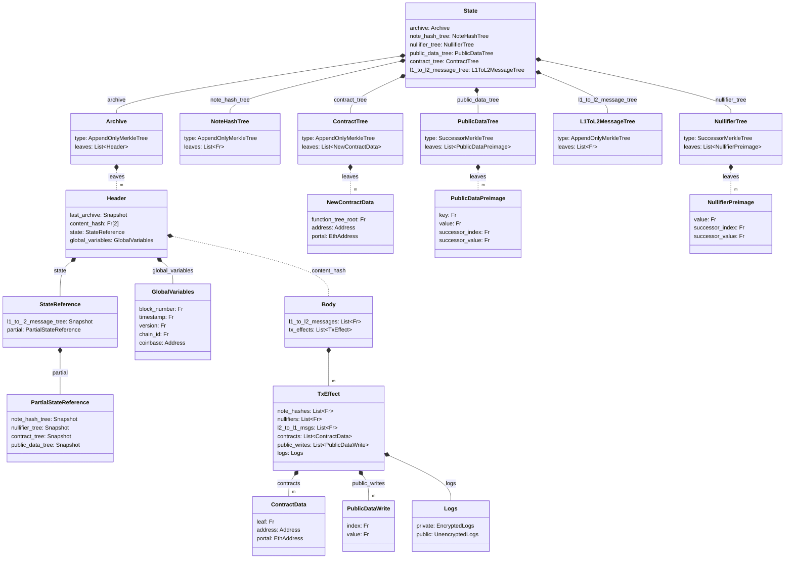

# State
The global state is the set of data that makes up Aztec - it is persisted and only updates when new blocks are added to the chain. The state consist of multiple different categories of data with varying requirements. Common for all of the categories is that they need strong integrity guarantees and efficient membership proofs. Like for most other blockchains, this can be enforced by structuring the data as leafs in Merkle trees. However, unlike most other blockchains, our contract state cannot use a Merkle tree as a key-value store for each contracts data. The reason being that we have both private and public state. While public state could be stored in a key-value tree, private state cannot - as doing so would leak information whenever the private state is updated, even if encrypted.

To work around this, we use a two-tree approach for state that can be used privately. Namely we have one (or more) tree(s) where data is added to (sometimes called a data tree), and a second tree where we "nullify" or mark the data as deleted. This allows us to "update" a leaf by adding a new leaf to the date trees, and add the nullifier of the old leaf to the second tree (the nullifier tree). That way we can show that the new leaf is the "active" one, and that the old leaf is "deleted".

When dealing with private data, only the hash of the data is stored in the leaf in our data tree and we must setup a derivation mechanism that ensure nullifiers can be computed deterministically from the pre-image (the data that was hashed). This way, no-one can tell what data is stored in the leaf (unless they already know it), and therefore won't be able to derive the nullifier and tell if the leaf is active or deleted. Whenever a user want to "delete" or "update" data, they can prove that they know the data and that it is still active (its nullifier is not in the nullifier tree). 
Simultaneously, this ensures that a user cannot "double-spend" data by nullifying it again, because it would fail the non-membership proof (this relies on the nullifier being deterministic from the data for security).

This ability to efficiently prove non-membership is one of the extra requirements we have for some parts of out state. To support the requirements most efficiently, we use two families of Merkle trees:
- The [Append-only Merkle tree](./tree_impls.md#append-only-merkle-trees), which supports efficient membership proofs,
- The [Indexed Merkle tree](./tree_impls.md#indexed-merkle-trees), which supports efficient membership and non-membership proofs but increase cost of adding leafs.

:::warning **Discussion Point**: 
"Indexed merkle tree" is not a very telling name, our normal merkle trees are indexed too. I propose we call them "successor merkle trees" instead since each leaf refer to their successor. The low-nullifiers are are also the predecessor of the nullifier you are inserting, so it seems nice that you prove that the nullifier you are inserting has a predecessor and that the predecessors successor would also be the successor of the nullifier you are inserting.
:::

Another important aspect of state in Aztec is *when* it can be accessed. In most blockchains, state is accessed at the head of the chain, and the state is updated as new blocks are added. However, since private execution relies on proofs generated by the user this would be very impractical - one users transaction would invalidate everyone elses. Instead, private execution relies on historical state, where the user can prove that the state they are accessing is valid, and then emit nullifiers (as mentioned above) to ensure that the state accessed was up to date. The nullifiers being emitted addresses the issue of double-spending, so as long as users are spending each others notes there will be no collisions.

Below is a short description of the state catagories (trees) and why they have the type they have.
- [**Note Hashes**](./note_hash_tree.md): A set of hashes (commitments) of the individual blobs of contract data (we call these blobs of data notes). New notes can be created and their hashes inserted through contract execution. We need to support efficient membership proofs as any read will require one to prove validity. The set is represented as an [Append-only Merkle tree](./tree_impls.md#append-only-merkle-trees), storing the note hashes as leafs.
- [**Nullifiers**](./nullifier_tree.md): A set of nullifiers for notes that have been spent. We need to support efficient non-membership proofs since we need to check that a note has not been spent before it can be used. The set is represented as an [Indexed Merkle tree](./tree_impls.md#indexed-merkle-trees).
- [**Public Data**](./public_data_tree.md): The key-value store for public contract state. We need to support both efficient membership and non-membership proofs! We require both, since the tree is "empty" from the start. Meaning that if the key is not already stored (non-membership), we need to insert it, and if it is already stored (membership) we need to just update the value.
- **Contracts**: The set of deployed contracts. We need to support efficient membership proofs as we need to check that a contract is deployed before we can interact with it. The set is represented as an [Append-only Merkle tree](./tree_impls.md#append-only-merkle-trees).
- **L1 to L2 Messages**: The set of messages sent from L1 to L2. The set itself only needs to support efficient membership proofs, so we can ensure that the message was correctly sent from L1. However, it utilizes the Nullifier tree from above to ensure that the message cannot be processed twice. The set is represented as an [Append-only Merkle tree](./tree_impls.md#append-only-merkle-trees).
- [**Archive**](./archive.md): The set of block headers that have been processed. We need to support efficient membership proofs as this is used in private execution to get the roots of the other trees. The set is represented as an [Append-only Merkle tree](./tree_impls.md#append-only-merkle-trees).

To recall, the global state in Aztec is represented by a set of Merkle trees: the [Note Hash tree](./note_hash_tree.md), [Nullifier tree](./nullifier_tree.md), and [Public Data tree](./public_data_tree.md) reflect the latest state of the chain, while the L1 to L2 message tree allows for [cross-chain communication](../contracts/#l2-outbox) and the [Archive](./archive.md) allows for historical state access.

import DocCardList from '@theme/DocCardList';

<DocCardList />
